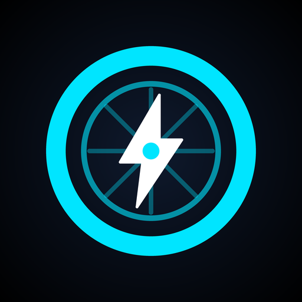
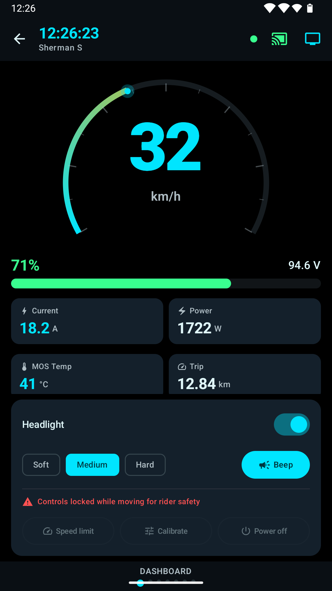
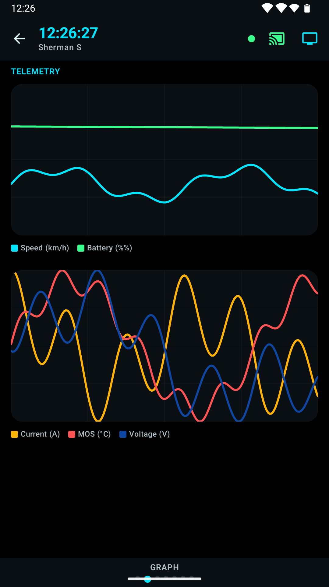
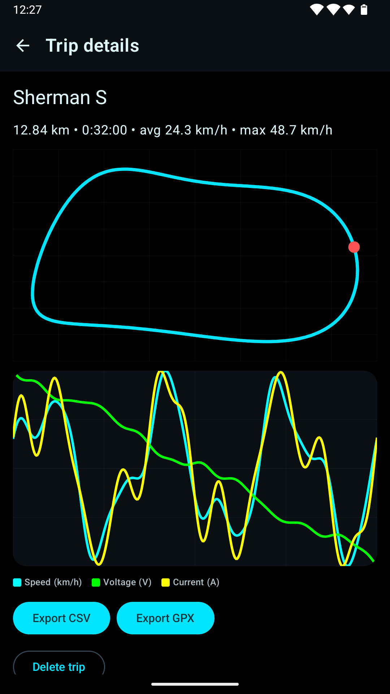
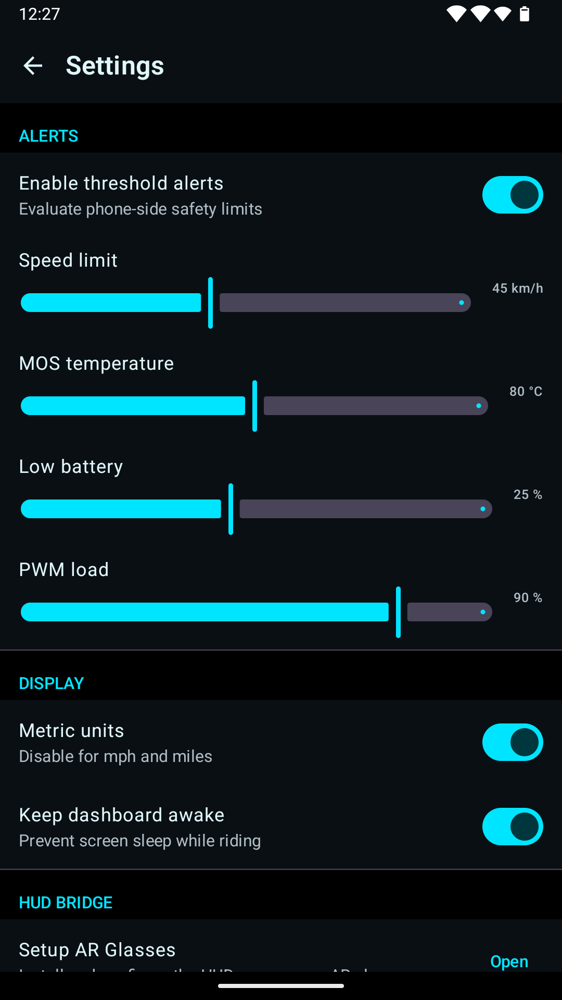
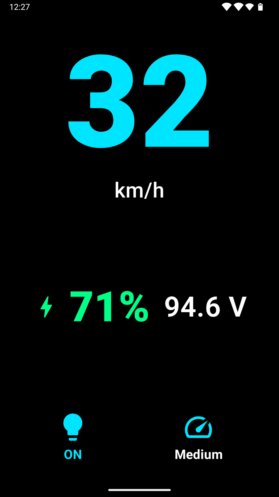
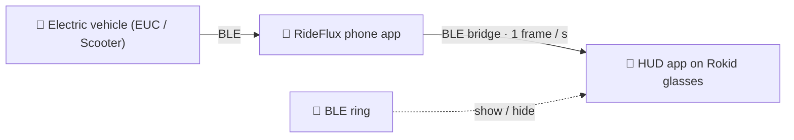

<div align="center">



# RideFlux

**A live dashboard for electric unicycles — with an optional AR-glasses HUD.**

Speed · Battery · Temperature · PWM alerts · Trip recording · Rokid HUD

[**English**](README.md) &nbsp;·&nbsp; [繁體中文](README.zh-TW.md) &nbsp;·&nbsp; [Website](https://zero2005x.github.io/RideFlux/) &nbsp;·&nbsp; [Privacy](PRIVACY.md) &nbsp;·&nbsp; [Docs](docs/README.md) &nbsp;·&nbsp; [Story](https://zero2005x.github.io/RideFlux/story/) &nbsp;·&nbsp; [PLEV White Paper](docs/PLEV_ARCHITECTURE_WHITE_PAPER.md)

<a href="https://play.google.com/store/apps/details?id=com.rideflux.app">
  
</a>

[](https://github.com/zero2005x/RideFlux/releases/latest)
[](https://github.com/zero2005x/RideFlux/actions/workflows/ci.yml)
[](https://sonarcloud.io/project/overview?id=zero2005x_RideFlux)
[](#license)
[](#get-rideflux)
[](docs/LOCALIZATION.md)

<br>







<sub>Screenshots show sample data, not a real ride.</sub>

</div>

---

## What it does

RideFlux connects to your electric unicycle (EUC) over Bluetooth Low Energy and shows what the wheel is doing, live, on your phone — and, if you have them, on AR glasses. Electric-scooter support is still in development (see [Supported vehicles](#supported-vehicles)).

| | |
|---|---|
| ⚡ **Live dashboard** | Speed gauge, battery %, voltage, current, power and temperatures, plus BMS details, live charts, parameter and event pages. Automatically adapts layout for scooters and EUCs. |
| 🛡️ **Safety alerts & interlock** | Overspeed, over-temperature, low battery and high PWM load. Motion interlock locks risky commands until the vehicle has reported three fresh zero-speed readings. |
| 🗺️ **Trip recording** | Starts by itself when the vehicle starts moving. Every ride keeps its route plus speed, voltage and current. Export a trip as **CSV** or **GPX**, or back up all trips and settings to a ZIP. |
| 🥽 **AR glasses HUD** | An optional heads-up display on Rokid AR glasses, so you can keep your eyes up. A Bluetooth ring can show or hide it. [More ↓](#ar-glasses-hud) |
| 🎛️ **Vehicle controls** | Headlight, horn, speed limit, calibration and remote power-off on unicycles — where the wheel supports them. Calibration, speed limit and power-off are refused unless the wheel has reported three fresh zero-speed readings. |
| 🔒 **Private by design** | No internet permission, no ads, no analytics, no accounts. Everything stays on your phone unless you export it. |
| 🌍 **18 languages** | Follows the device language by default, with a separate language choice on phone and glasses. Includes right-to-left Arabic and Urdu. |

## AR glasses HUD



- **One link to the vehicle.** The phone holds the vehicle's single BLE connection and relays a compact frame (speed, battery, voltage, trip, stale flag) to the glasses, so two devices never fight over the peripheral. The glasses can also read the vehicle directly when no phone is around.
- **Only your phone.** The glasses pair to a token that the phone mints on first run, not to a Bluetooth address that rotates every few minutes, and the phone only streams to glasses you approved.
- **Hands-free.** A Bluetooth ring paired to the glasses reveals or blanks the HUD. A safety alert still breaks through a blanked HUD.
- **Optional.** The phone app is a complete dashboard on its own.

**Hardware it is developed and tested on:** a Begode A2 wheel, **Rokid Glasses RV101** (standalone glasses that connect to the phone wirelessly, no cable), and an Android phone.

How the bridge works, byte by byte: [docs/BRIDGE_PROTOCOL.md](docs/BRIDGE_PROTOCOL.md).

## Supported vehicles

### Electric Unicycles (EUC)
| Brand | Models | Status |
|---|---|---|
| **Begode** / Gotway / ExtremeBull | A2 | ✅ **Verified on hardware** — a few readings (trip distance, PWM) are known to be off and are being fixed |
| | Other models, dual-BMS | 🧪 Experimental |
| **KingSong** | — | 🧪 Experimental |
| **Veteran** | Sherman, Abrams, Patton, Lynx, Oryx, Nosfet | 🧪 Experimental |
| **Ninebot** | One, E+, S2, Mini · Z, ZT, KickScooter Z | 🧪 Experimental |
| **Inmotion** | V5, V8, V10 · V9, V11, V12, V13, V14 | 🧪 Experimental |

### Electric Scooters (PLEV) & Smart BMS
| Category | Brand / Lineage | Status |
|---|---|---|
| **Scooter** | **Ninebot Retail** (KickScooter ES2 is the reference model) | 🚧 In development — frame codec, pairing state machine and B0 telemetry are written from reverse-engineering notes. Never connected to a real scooter. Pairing and lock stay blocked in the app until a per-model stationary-speed source is verified |
| **Scooter** | **Xiaomi M365** | 🚧 In development — BLE transport, FE95 authentication, registration consent flow, encrypted UART and B0 telemetry are implemented from reverse-engineering notes (L2). Lock and power writes remain blocked in the app. |
| **Smart BMS** | **JBD / Xiaoxiang & Ant BMS** | 🧪 Packet decoders (read-only) |
| **Controller** | **VESC** | 🧪 Telemetry decoder (read-only) |

- ✅ **Verified on hardware** means the developer connected a real wheel of that model and checked the app against it.
- 🧪 **Experimental** means the decoder is implemented from open-source references and recorded test frames, but has **not** been tried on a real vehicle. It may misread values on yours. Compare it with your vehicle's own display before you rely on it for safety.
- **Own one of the experimental vehicles?** A short report helps a lot — [open an issue](https://github.com/zero2005x/RideFlux/issues) with the model, firmware, and what RideFlux showed against what the vehicle's own display showed.

The wire formats and GATT layouts behind each family: [docs/PROTOCOLS.md](docs/PROTOCOLS.md) & [PLEV White Paper](docs/PLEV_ARCHITECTURE_WHITE_PAPER.md).

## Get RideFlux

| | |
|---|---|
| 📱 **Phone app** | [**Google Play**](https://play.google.com/store/apps/details?id=com.rideflux.app) — Android 9 (API 28) or later. |
| 🥽 **Glasses HUD app** | An APK on [GitHub Releases](https://github.com/zero2005x/RideFlux/releases/latest), for sideloading on Rokid glasses (developed and tested on the Rokid Glasses RV101). |
| 📖 **The story** | [Why and how RideFlux was built](https://zero2005x.github.io/RideFlux/story/) — see the section below. |
| 🛠️ **From source** | See [docs/BUILDING.md](docs/BUILDING.md). |

```bash
./gradlew :app:assembleDebug        # phone APK
./gradlew :hud-app:assembleDebug    # glasses APK
./gradlew test                      # JVM unit tests
```

Built with Kotlin, Jetpack Compose, Hilt, Room and DataStore. You need **JDK 17 or 21**; newer JDKs are not verified.

## The story behind RideFlux

A long-form write-up of how the project came to be: why it is not a WheelLog fork, how the Bluetooth protocols were decoded and which bugs real frames exposed, how the phone talks to the glasses, and what is verified and what is not. It was first published on Medium in December 2025 and has been updated for what RideFlux is today. It is written in English.

- **Read it on the website:** [zero2005x.github.io/RideFlux/story](https://zero2005x.github.io/RideFlux/story/) — the same text as the source file below, rendered with the site's layout.
- **Source in this repository:** [docs/articles/cyberpunk-commute-update-2026-10.md](docs/articles/cyberpunk-commute-update-2026-10.md), with a [change list](docs/articles/cyberpunk-commute-update-2026-10.changes.md) (in Traditional Chinese) saying what differs from the Medium original and why.
- **Original post:** [on Medium](https://medium.com/@20x05zero/cyberpunk-commute-building-an-ar-heads-up-display-for-the-inmotion-v5f-2d5264bb451e).

## Privacy

- **No internet access.** The app declares no `INTERNET` permission, so it cannot send anything off your phone.
- **No tracking.** No ads, analytics, crash reporting or accounts.
- **Location only while recording.** It is used to draw a trip's route, runs as a visible foreground service, and is never requested in the background. Deny it and trips are still recorded, without a route.
- **Your data, your call.** Trips stay on the phone until you export them; Android cloud backup is switched off for the app.

Full text: [PRIVACY.md](PRIVACY.md).

## For developers

The technical reference that used to fill this README now lives in [`docs/`](docs/README.md), word for word.

| Document | What is in it |
|---|---|
| [Architecture](docs/ARCHITECTURE.md) | Module layering, design rules, repository layout |
| [Wheel protocols](docs/PROTOCOLS.md) | Wheel families, GATT topologies, where the protocol knowledge comes from |
| [Phone ↔ glasses bridge](docs/BRIDGE_PROTOCOL.md) | Pairing token, startup ordering, scan budget, frame layout |
| [Localization](docs/LOCALIZATION.md) | The 18 translations, the coverage test, how to add a string or a language |
| [Building & releasing](docs/BUILDING.md) | JDK and SDK, signing and secrets, tests, Sonar, dependency verification |
| [Play Store assets](docs/play-store/README.md) | Store graphics and the scripts that regenerate them |
| [Website](site/README.md) | The GitHub Pages site in `site/` and how it is built |
| [Articles](docs/articles/) | Long-form writing about the project; the website's `/story/` page is rendered from the article here |

## Disclaimer

RideFlux is an independently developed third-party application. It is **not** affiliated with, endorsed by, or sponsored by any of the wheel manufacturers or Rokid named above; those names are trademarks of their owners and appear only to say which products RideFlux can talk to. Pay attention to the road while you ride and **do not operate your phone while riding**.

## License

Distributed under the **GNU General Public License v3.0 or later**. Source files carry
`SPDX-License-Identifier: GPL-3.0-or-later`. See [`LICENSE`](LICENSE) for the full text.

### Additional permission: Rokid CXR SDK

The RideFlux project contributors, as the copyright holders of the RideFlux source code,
grant the following additional permission under section 7 of the GNU General Public License,
version 3. It applies to the RideFlux source code in this repository; the GPL applies
unchanged otherwise.

> If you modify this Program, or any covered work, by linking or combining it with the Rokid
> CXR SDK libraries (`com.rokid.cxr:client-m` and `com.rokid.cxr:cxr-service-bridge`) (or a
> modified version of those libraries), containing parts covered by the terms under which
> Rokid provides them, the licensors of this Program grant you additional permission to
> convey the resulting work.

This permission does **not**:

- give you any rights in the Rokid libraries. They are Rokid's proprietary software and are
  not licensed by this project; Rokid's own terms govern whether and how you may use and
  redistribute them (see [`NOTICE`](NOTICE));
- reach material that other people wrote, such as the third-party material listed in
  [`NOTICE`](NOTICE), which stays under its own license.

As section 7 of the GPL allows, you may remove this additional permission from your copy of
the Program, or from any part of it.

## Acknowledgements

Some protocol test data comes from [WheelLog](https://github.com/Wheellog/Wheellog.Android), and the Rokid CXR SDK is Rokid's own software. Credits and terms are in [`NOTICE`](NOTICE).
