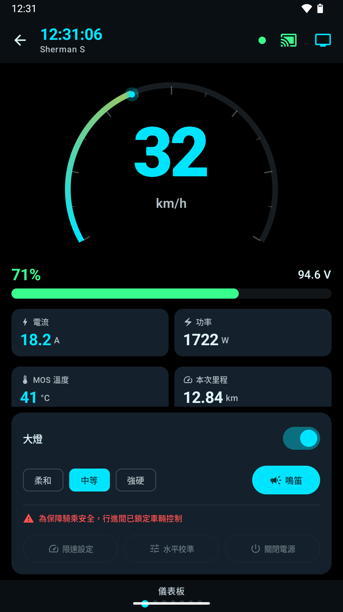
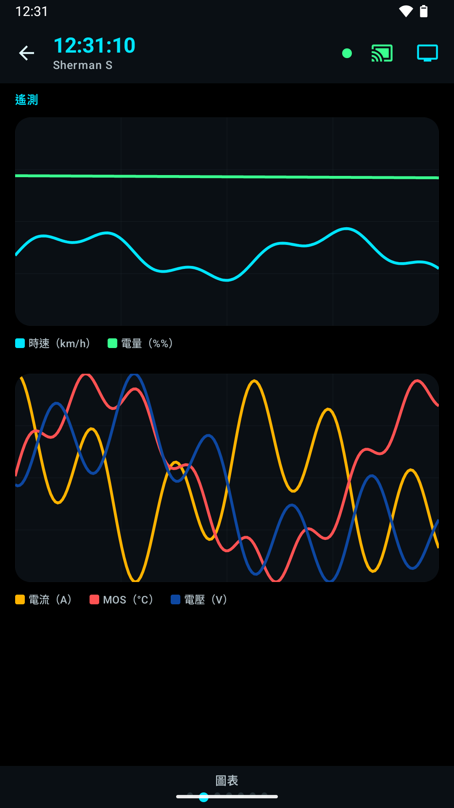
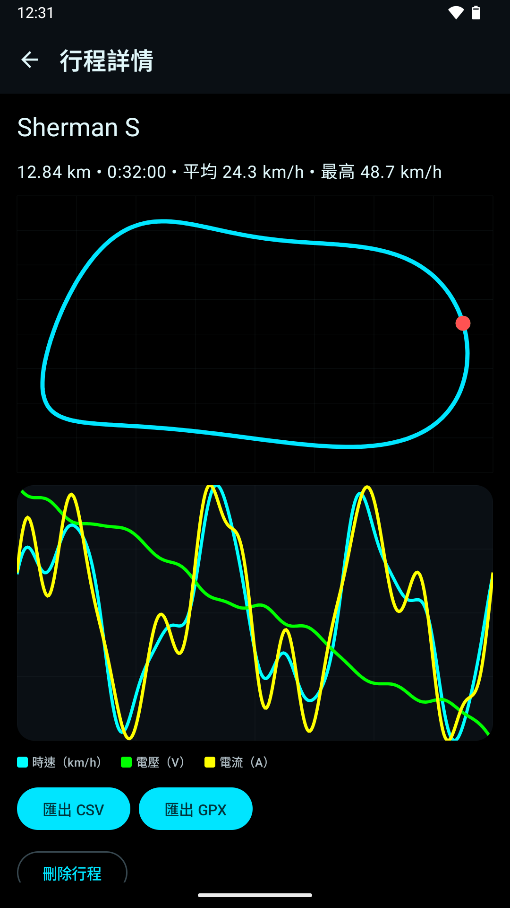
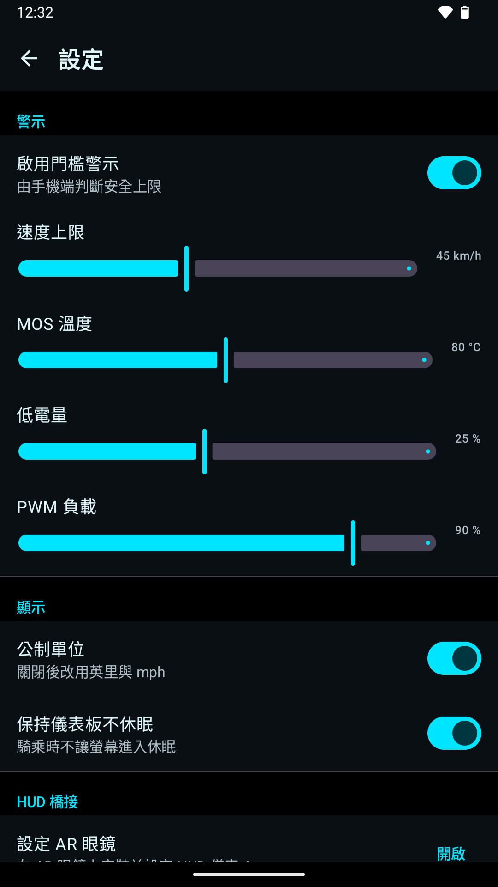
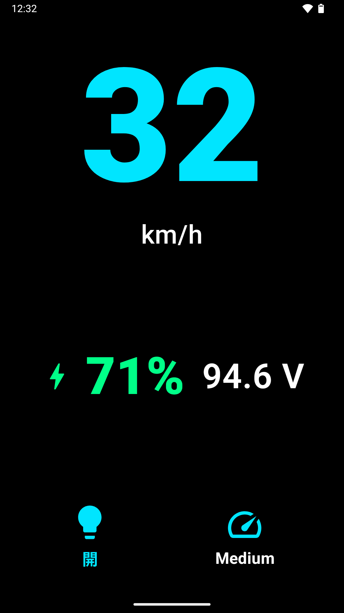
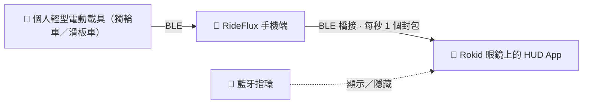

<div align="center">


# RideFlux

**電動獨輪車即時儀表板——並可搭配 AR 眼鏡抬頭顯示。**

時速 · 電量 · 溫度 · PWM 警示 · 行程記錄 · Rokid HUD

[English](README.md) &nbsp;·&nbsp; [**繁體中文**](README.zh-TW.md) &nbsp;·&nbsp; [官方網站](https://zero2005x.github.io/RideFlux/zh-TW/) &nbsp;·&nbsp; [隱私權政策](PRIVACY.md) &nbsp;·&nbsp; [開發文件](docs/README.md) &nbsp;·&nbsp; [故事（英文）](https://zero2005x.github.io/RideFlux/story/) &nbsp;·&nbsp; [PLEV 白皮書](docs/PLEV_ARCHITECTURE_WHITE_PAPER.md)

<a href="https://play.google.com/store/apps/details?id=com.rideflux.app&hl=zh-TW">
  
</a>

[](https://github.com/zero2005x/RideFlux/releases/latest)
[](https://github.com/zero2005x/RideFlux/actions/workflows/ci.yml)
[](https://sonarcloud.io/project/overview?id=zero2005x_RideFlux)
[](#授權)
[](#取得-rideflux)
[](docs/LOCALIZATION.md)

<br>







<sub>截圖為範例資料，並非真實騎乘紀錄。</sub>

</div>

---

## 它能做什麼

RideFlux 透過藍牙低功耗（BLE）連線到您的電動獨輪車，把車輪當下的狀態即時顯示在手機上——如果您有 AR 眼鏡，也能顯示在眼鏡上。

| | |
|---|---|
| ⚡ **即時儀表板** | 時速儀表、電量 %、電壓、電流、功率與各處溫度，另有 BMS 詳情、即時圖表，以及參數與事件頁面。自適應滑板車與獨輪車布局。 |
| 🛡️ **安全警示與動態聯鎖** | 超速、過熱、低電量與 PWM 負載過高。內建去彈跳、冷卻與遲滯機制，移動中強制鎖定危險控制。自動過濾無效速度哨兵值（0xFF00）。 |
| 🗺️ **行程記錄** | 車輛開始移動時自動開始記錄。每趟騎乘都保留路線，以及時速、電壓與電流。可將行程匯出為 **CSV** 或 **GPX**，也可把所有行程與設定備份成 ZIP。 |
| 🥽 **AR 眼鏡 HUD** | 選用的 Rokid AR 眼鏡抬頭顯示，讓您的視線保持在前方。可用藍牙指環一鍵顯示或隱藏。[詳見 ↓](#ar-眼鏡-hud) |
| 🎛️ **車輛控制** | 獨輪車的大燈、喇叭、速度上限、校準與遠端關機（視車型支援）。校準、速度上限與關機須車輪連續回報三筆時速為零才會執行。 |
| 🔒 **隱私優先** | 沒有網路權限、沒有廣告、沒有數據分析、沒有帳號。除非您主動匯出，所有資料都只留在手機裡。 |
| 🌍 **18 種語言** | 預設跟隨裝置語言，手機與眼鏡可各自選擇；包含由右至左排版的阿拉伯語與烏爾都語。 |

## AR 眼鏡 HUD



- **只佔載具一條連線。** 手機獨佔載具唯一的 BLE 連線，再把精簡封包（時速、電量、電壓、行程、資料過期旗標）轉播給眼鏡，因此兩個裝置不會搶同一個週邊。沒有手機在身邊時，眼鏡也可以直接讀取載具。
- **只認您的手機。** 眼鏡配對的是手機首次啟動時產生的權杖，而不是幾分鐘就會輪替的藍牙位址；手機也只會把資料串流給您核准過的眼鏡。
- **免動手。** 與眼鏡配對的藍牙指環可以顯示或隱藏 HUD。安全警示即使在 HUD 被隱藏時也會跳出來。
- **選用。** 手機端單獨使用就是一個完整的儀表板。

**開發與測試所用的硬體：** Begode A2 電動獨輪車、**Rokid Glasses RV101**（獨立運作、以無線方式連接手機、不需要接線的眼鏡），以及一支 Android 手機。

橋接的運作細節（逐位元組）：[docs/BRIDGE_PROTOCOL.md](docs/BRIDGE_PROTOCOL.md#繁體中文)。

## 支援的載具

### 電動獨輪車（EUC）
| 品牌 | 型號 | 狀態 |
|---|---|---|
| **Begode** / Gotway / ExtremeBull | A2 | ✅ **已實機驗證** —— 少數讀數（行程距離、PWM）已知有偏差，修正中 |
| | 其他型號、雙 BMS | 🧪 實驗性 |
| **KingSong** | — | 🧪 實驗性 |
| **Veteran** | Sherman、Abrams、Patton、Lynx、Oryx、Nosfet | 🧪 實驗性 |
| **Ninebot** | One、E+、S2、Mini · Z、ZT、KickScooter Z | 🧪 實驗性 |
| **Inmotion** | V5、V8、V10 · V9、V11、V12、V13、V14 | 🧪 實驗性 |

### 電動滑板車（PLEV）與智慧 BMS
| 類別 | 品牌／協定家族 | 狀態 |
|---|---|---|
| **電動滑板車** | **Ninebot Retail**（以 KickScooter ES2 為基準車型） | 🚧 開發中——封包編解碼、配對狀態機與 B0 遙測依逆向筆記撰寫，從未連過真實滑板車。在驗證各車型的靜止速度來源之前，App 內的配對與鎖車維持封鎖 |
| **電動滑板車** | **Xiaomi 小米 M365** | 🚧 開發中——BLE 傳輸、FE95 認證、註冊確認流程、加密 UART 與 B0 遙測依逆向筆記實作（L2）。App 內維持封鎖鎖車與關機寫入。 |
| **智慧 BMS** | **JBD / 小象 BMS 與 Ant 螞蟻 BMS** | 🧪 封包解碼器（唯讀） |
| **驅動控制器** | **VESC** | 🧪 遙測解碼器（唯讀） |

- ✅ **已實機驗證**：開發者實際連過該型號的真車，並拿 App 的顯示與車輛對照過。
- 🧪 **實驗性**：解碼器依開源參考資料與錄下的測試封包實作，但**尚未**在真車上試過，在您的車上可能讀錯數值。若要把它當成安全依據，請先與車輛本身的顯示對照。
- **您有實驗性車款的車嗎？** 一份簡短回報幫助很大——請到 [GitHub Issues](https://github.com/zero2005x/RideFlux/issues) 開一則，附上型號、韌體版本，以及 RideFlux 顯示的數值與車輛本身顯示的數值。

各家族背後的傳輸格式與 GATT 配置：[docs/PROTOCOLS.md](docs/PROTOCOLS.md#繁體中文) & [PLEV 白皮書](docs/PLEV_ARCHITECTURE_WHITE_PAPER.md)。

## 取得 RideFlux

| | |
|---|---|
| 📱 **手機端 App** | [**Google Play**](https://play.google.com/store/apps/details?id=com.rideflux.app&hl=zh-TW) —— 需要 Android 9（API 28）以上。 |
| 🥽 **眼鏡端 HUD App** | 放在 [GitHub Releases](https://github.com/zero2005x/RideFlux/releases/latest) 的 APK，供 Rokid 眼鏡側載安裝（以 Rokid Glasses RV101 開發與測試）。 |
| 📖 **故事** | [RideFlux 為什麼、怎麼做出來](https://zero2005x.github.io/RideFlux/story/)（英文）——見下一節。 |
| 🛠️ **從原始碼建置** | 請見 [docs/BUILDING.md](docs/BUILDING.md#繁體中文)。 |

```bash
./gradlew :app:assembleDebug        # 手機 APK
./gradlew :hud-app:assembleDebug    # 眼鏡 APK
./gradlew test                      # JVM 單元測試
```

以 Kotlin、Jetpack Compose、Hilt、Room 與 DataStore 打造。需要 **JDK 17 或 21**；更新的 JDK 尚未驗證。

## RideFlux 背後的故事

一篇長文，記錄這個專案怎麼來的：為什麼不是 WheelLog 的 fork、藍牙協定如何解碼以及真實封包抓出哪些 bug、手機如何與眼鏡通訊，以及哪些功能已驗證、哪些還沒有。它最初於 2025 年 12 月發表在 Medium，現已依 RideFlux 目前的樣貌更新。**文章以英文撰寫。**

- **在網站上閱讀：** [zero2005x.github.io/RideFlux/story](https://zero2005x.github.io/RideFlux/story/)——內容與下方的原始檔相同，只是套用網站的版型。
- **本儲存庫中的原始檔：** [docs/articles/cyberpunk-commute-update-2026-10.md](docs/articles/cyberpunk-commute-update-2026-10.md)，另附[修改清單](docs/articles/cyberpunk-commute-update-2026-10.changes.md)（繁體中文），說明與 Medium 原文有何不同、為什麼。
- **原文：** [Medium 上的貼文](https://medium.com/@20x05zero/cyberpunk-commute-building-an-ar-heads-up-display-for-the-inmotion-v5f-2d5264bb451e)。

## 隱私

- **沒有網路存取。** App 沒有宣告 `INTERNET` 權限，因此無法把任何東西傳出手機。
- **沒有追蹤。** 沒有廣告、數據分析、當機回報或帳號。
- **只在記錄行程時使用位置。** 用來繪製行程路線，以可見的前景服務執行，也不會在背景要求位置。拒絕授權的話，行程仍會記錄，只是沒有路線。
- **資料由您決定。** 行程在您匯出之前都留在手機裡；本 App 已關閉 Android 雲端備份。

完整內容：[PRIVACY.md](PRIVACY.md#繁體中文)。

## 給開發者

過去塞滿這份 README 的技術參考資料，現在逐字放在 [`docs/`](docs/README.md)。

| 文件 | 內容 |
|---|---|
| [架構](docs/ARCHITECTURE.md#繁體中文) | 模組分層、設計規則、儲存庫目錄結構 |
| [車輛通訊協定](docs/PROTOCOLS.md#繁體中文) | 車輛家族、GATT 拓撲、協定知識的來源 |
| [手機 ↔ 眼鏡橋接](docs/BRIDGE_PROTOCOL.md#繁體中文) | 配對權杖、啟動順序、掃描預算、封包版面 |
| [多國語系](docs/LOCALIZATION.md#繁體中文) | 18 種翻譯、覆蓋率測試、如何新增字串或語言 |
| [建置與發行](docs/BUILDING.md#繁體中文) | JDK 與 SDK、簽章與機密、測試、Sonar、相依驗證 |
| [Play 商店素材](docs/play-store/README.md#繁體中文) | 商店圖片，以及重新產生它們的腳本 |
| [網站](site/README.md) | `site/` 裡的 GitHub Pages 網站與其建置方式 |
| [文章](docs/articles/) | 關於專案的長文；網站的 `/story/` 頁就是由這裡的文章轉出來的 |

## 聲明

RideFlux 是獨立開發的第三方應用程式，與上述任何車輛製造商或 Rokid **沒有**隸屬、背書或贊助關係；這些名稱是其各自所有人的商標，在此僅用來說明 RideFlux 能與哪些產品通訊。騎乘時請留意路況，**請勿在騎乘時操作手機**。

## 授權

本專案依 **GNU General Public License v3.0 或後續版本**散布。原始碼檔案皆標註
`SPDX-License-Identifier: GPL-3.0-or-later`。完整條款請見 [`LICENSE`](LICENSE)。

### 附加許可：Rokid CXR SDK

RideFlux 專案貢獻者作為 RideFlux 原始碼的著作權人，依 GNU 通用公眾授權條款第 3 版（GPLv3）
第 7 條額外授予下列許可。它適用於本儲存庫中的 RideFlux 原始碼，其餘仍依 GPL 原文適用。以下
為摘要翻譯，**以[英文版](README.md#additional-permission-rokid-cxr-sdk)為準**：

> 若您透過連結或結合 Rokid CXR SDK 函式庫（`com.rokid.cxr:client-m` 與
> `com.rokid.cxr:cxr-service-bridge`，或其修改版本），使本程式或任何涵蓋作品（covered work）
> 含有適用 Rokid 提供該函式庫所依條款的部分，則本程式的授權人授予您額外許可，允許您散布
> （convey）所產生的作品。

此許可**不會**：

- 賦予您任何 Rokid 函式庫的權利。它們是 Rokid 的專有軟體，並非由本專案授權；是否及如何使用、
  再散布，依 Rokid 自己的條款（見 [`NOTICE`](NOTICE)）；
- 涵蓋他人撰寫的內容，例如 [`NOTICE`](NOTICE) 所列的第三方內容，它們仍適用各自的授權。

依 GPL 第 7 條，您可以自行將此附加許可從您的副本或其任何部分移除。

## 致謝

部分協定測試資料取自 [WheelLog](https://github.com/Wheellog/Wheellog.Android)；Rokid CXR SDK 則是 Rokid 自己的軟體。致謝與條款見 [`NOTICE`](NOTICE)。
