# Wheellog.Android Bluetooth Protocol Specification (Complete Consolidated Edition)

**Reference Project**: `Wheellog/Wheellog.Android`  
**Document Version**: v3.1 (v3.0 + Source tags, test vectors, Android BLE permissions, Coroutines/Flow, Gotway alert bitmask, disconnection edge cases)  
**Date**: 2026-03-22  
**Source Code Reference**:
- Latest Release: [3.2.7](https://github.com/Wheellog/Wheellog.Android/releases/tag/3.2.7) — commit [`a93b80e`](https://github.com/Wheellog/Wheellog.Android/commit/a93b80e2e3cf508f4260f8a2f63a1ab6333d66a3) (Oct 6, 2025)
- Master HEAD at time of analysis: [`dcf5667`](https://github.com/Wheellog/Wheellog.Android/commit/dcf5667) ("first try nosfet aeon (#548)")
- Repository: https://github.com/Wheellog/Wheellog.Android (Kotlin 67.2% / Java 32.8%, GPL-3.0, 22 contributors)


> **Note**: This specification is reverse-engineered from the Wheellog.Android source code and is implementation-oriented.  
> This edition covers complete packet structures for all brand adapters, byte-level field tables, crypto() implementation,  
> Gotway/Veteran frame structures, BMS sub-packets, complete command code tables, and more.

### Source Confidence Tags

Throughout this document, fields and tables are annotated with **source confidence tags** indicating the provenance of each piece of information:

| Tag                       | Meaning                                                                 |
| ------------------------- | ----------------------------------------------------------------------- |
| `confirmed from code`     | Directly verified in the Wheellog.Android source code                   |
| `inferred from packet capture` | Derived from analyzing raw BLE packet captures / HCI logs          |
| `community-derived`       | Reported by the EUC rider community (forums, Discord, GitHub issues)    |
| `unknown`                 | Purpose or behavior not yet verified; interpretation is speculative     |

> When no source tag is shown on a field, the default is **confirmed from code**.

---

## Table of Contents

1. [Document Purpose](#1-document-purpose)
2. [System Architecture Overview](#2-system-architecture-overview)
3. [BLE Communication Layer Design](#3-ble-communication-layer-design)
4. [GATT Device Identification Specification](#4-gatt-device-identification-specification)
5. [General Connection Lifecycle](#5-general-connection-lifecycle)
6. [General Read/Write Flow](#6-general-readwrite-flow)
7. [MTU and Fragmentation Specification](#7-mtu-and-fragmentation-specification)
8. [Raw Data Logging Format](#8-raw-data-logging-format)
9. [Wheel Type Routing Mechanism](#9-wheel-type-routing-mechanism)
10. [UUID Specification Reference Table](#10-uuid-specification-reference-table)
11. [KingSong Protocol Specification](#11-kingsong-protocol-specification)
12. [Ninebot Protocol Specification](#12-ninebot-protocol-specification)
13. [Ninebot Z Protocol Specification](#13-ninebot-z-protocol-specification)
14. [Inmotion v1 Protocol Specification](#14-inmotion-v1-protocol-specification)
15. [Inmotion v2 Protocol Specification](#15-inmotion-v2-protocol-specification)
16. [Gotway / Veteran Protocol Specification](#16-gotway--veteran-protocol-specification)
17. [Packet Encoding and Byte Order](#17-packet-encoding-and-byte-order)
18. [General State Machine and Timing Diagrams](#18-general-state-machine-and-timing-diagrams)
19. [Brand-Specific State Machines and Timing Diagrams](#19-brand-specific-state-machines-and-timing-diagrams)
20. [Packet Format Summary Table](#20-packet-format-summary-table)
21. [Command Code Index Table](#21-command-code-index-table)
22. [Checksum / Crypto / Unpacker Reference](#22-checksum--crypto--unpacker-reference)
23. [GATT Profile JSON Specification](#23-gatt-profile-json-specification)
24. [Profile Matcher Algorithm](#24-profile-matcher-algorithm)
25. [Kotlin Rewrite Architecture Guide](#25-kotlin-rewrite-architecture-guide)
26. [Brand-Specific Pseudo-code](#26-brand-specific-pseudo-code)
27. [Risks, Limitations and Pending Items](#27-risks-limitations-and-pending-items)
28. [Reference Source File List](#28-reference-source-file-list)
29. [Appendix A: Field Reference Tables](#29-appendix-a-field-reference-tables)
30. [Appendix B: Implementation Recommendations](#30-appendix-b-implementation-recommendations)
31. [Appendix C: Raw Hex Test Vectors](#31-appendix-c-raw-hex-test-vectors)

---

## 1. Document Purpose

The purpose of this document is to organize all Bluetooth-related low-level interaction content in the Wheellog.Android project into a readable engineering specification, covering:

- BLE connection and reconnection methods
- GATT Service / Characteristic / Descriptor UUIDs
- Wheel type identification methods (including JSON Profile Matching)
- Command write logic
- Notify / characteristic update packet receiving flow
- Brand-specific packet formats
- Checksum / verification / crypto / unpacking
- keep-alive / handshake / initialization state machine
- 20-byte and extended MTU frame behavior
- Raw packet logging format
- Kotlin rewrite architecture design

---

## 2. System Architecture Overview

The Bluetooth communication in this project uses a layered architecture:

### 2.1 Layer Model

```
┌────────────────────────────────────────────────┐
│  Layer 4: UI / ViewModel / AppUiState          │
│  Display speed, voltage, current, temp, etc.   │
├────────────────────────────────────────────────┤
│  Layer 3: Brand Protocol Adapter               │
│  KingSong / Ninebot / NinebotZ / Inmotion      │
│  Packet parsing, checksum, state machine,      │
│  keep-alive, command building                  │
├────────────────────────────────────────────────┤
│  Layer 2: Wheel Routing + Detection            │
│  Route by wheelType + GATT Profile Matching    │
├────────────────────────────────────────────────┤
│  Layer 1: BLE Central / GATT Transport         │
│  Scan/Connect/MTU/Notify/Write/Disconnect/     │
│  Reconnect                                     │
└────────────────────────────────────────────────┘
```

### 2.2 Data Path

```
BLE Peripheral
  -> BluetoothService.onCharacteristicUpdate()
  -> readData(characteristic, value)
  -> WheelData.decodeResponse(...)
  -> Brand Adapter decode(...)
  -> WheelData fields updated
  -> UI / Log / Alarm
```

### 2.3 Core Module Mapping

| Module                          | Responsibility                                       |
| ------------------------------- | ---------------------------------------------------- |
| `BluetoothService.kt`          | BLE central, connection, notify, write, raw logging  |
| `Constants.kt`                 | UUID and wheel type constants                        |
| `WheelData.java`               | Unified data model and adapter routing               |
| Various Adapters               | Brand-specific protocol implementations              |
| `bluetooth_services.json`      | GATT profile to wheel type mapping                   |
| `bluetooth_proxy_services.json`| Proxy profile to wheel type mapping                  |

### 2.4 Local Project Architecture (Kotlin Rewrite Skeleton)

```
com.example.wheelclient/
├─ ble/
│   └─ BleRepository.kt        ← BLE + Profile Match + Protocol integration
├─ detect/
│   ├─ AdapterNameMapper.kt     ← adapter string → WheelType
│   ├─ DeviceProfile.kt         ← Hardcoded profile data structure
│   ├─ DeviceProfiles.kt        ← Hardcoded profile list
│   ├─ JsonGattProfile.kt       ← JSON-loaded profile data structure
│   ├─ JsonProfileLoader.kt     ← Load profiles from res/raw JSON
│   ├─ JsonProfileMatcher.kt    ← JSON profile scoring comparison
│   ├─ MatchResult.kt           ← Match result (score/confidence)
│   └─ ProfileMatcher.kt        ← Hardcoded profile scoring comparison
├─ model/
│   └─ AppUiState.kt            ← UI state model
├─ protocol/
│   ├─ ProtocolFactory.kt       ← Create protocol by WheelType
│   └─ StubProtocol.kt          ← Placeholder protocol for unimplemented brands
├─ ui/
│   └─ WheelScreen.kt           ← Compose UI
└─ viewmodel/
    └─ WheelViewModel.kt        ← ViewModel
```

---

## 3. BLE Communication Layer Design

### 3.1 BLE Library Used

The original project uses `com.welie.blessed.*`:

- `BluetoothCentralManager`
- `BluetoothPeripheral`
- `BluetoothCentralManagerCallback`
- `BluetoothPeripheralCallback`
- `ConnectionState`
- `WriteType`

### 3.2 Transport Type

Explicitly specified: `Transport.LE`

```kotlin
fun connect(): Boolean {
    central.transport = Transport.LE
    ...
}
```

### 3.3 Rewrite Version (Local Project)

The local Kotlin skeleton uses the native Android BLE API, encapsulated through `BleManager.kt` and `BleRepository.kt`.

### 3.4 Android BLE Permissions (Android 12+ / API 31+)

Starting from Android 12 (API level 31), the Bluetooth permission model changed significantly. The legacy `BLUETOOTH` and `BLUETOOTH_ADMIN` permissions are no longer sufficient for scanning and connecting.

**Required Runtime Permissions** (`source: confirmed from Android documentation`):

| Permission             | Purpose                          | When Required          |
| ---------------------- | -------------------------------- | ---------------------- |
| `BLUETOOTH_SCAN`       | Discover nearby BLE devices      | Before `startScan()`   |
| `BLUETOOTH_CONNECT`    | Connect to paired/discovered BLE devices | Before `connectGatt()` |
| `BLUETOOTH_ADVERTISE`  | Act as a BLE peripheral (not needed for Wheellog) | N/A |
| `ACCESS_FINE_LOCATION` | Required **only if** deriving physical location from scan results | Only if `neverForLocation` not set |

**AndroidManifest.xml Configuration**:

```xml
<!-- Android 12+ (API 31+) -->
<uses-permission android:name="android.permission.BLUETOOTH_SCAN"
    android:usesPermissionFlags="neverForLocation" />
<uses-permission android:name="android.permission.BLUETOOTH_CONNECT" />

<!-- Android 11 and below (backward compatibility) -->
<uses-permission android:name="android.permission.BLUETOOTH"
    android:maxSdkVersion="30" />
<uses-permission android:name="android.permission.BLUETOOTH_ADMIN"
    android:maxSdkVersion="30" />
<uses-permission android:name="android.permission.ACCESS_FINE_LOCATION"
    android:maxSdkVersion="30" />
```

**Key Notes**:

- The `neverForLocation` flag on `BLUETOOTH_SCAN` tells Android that scan results will **not** be used to derive physical location, eliminating the need for `ACCESS_FINE_LOCATION` on API 31+.
- Both `BLUETOOTH_SCAN` and `BLUETOOTH_CONNECT` are **runtime permissions** — they must be requested via `ActivityCompat.requestPermissions()` at runtime, not just declared in the manifest.
- If permissions are not granted, `startScan()` silently returns no results, and `connectGatt()` throws a `SecurityException`.
- Wheellog handles this in `BluetoothService` by checking permissions before BLE operations.

**GATT_ERROR 133 on Permission Issues**:

On some devices (notably Samsung and Xiaomi), attempting BLE operations without proper permissions does not throw a `SecurityException` but instead returns `GATT_ERROR` (status 133). See §5.5 for retry strategies.

---

## 4. GATT Device Identification Specification

The project does not rely solely on device name for wheel type identification; instead, it matches based on the actual GATT service combination.

### 4.1 Identification Data Sources

- `res/raw/bluetooth_services.json` — Official service profiles
- `res/raw/bluetooth_proxy_services.json` — Proxy / alternative profiles

### 4.2 Identification Flow

```
onServicesDiscovered()
  -> detectWheel(bluetooth_services.json)
  -> If failed -> detectWheel(bluetooth_proxy_services.json)
  -> If still failed -> disconnect
  -> If succeeded -> broadcast ACTION_WHEEL_TYPE_RECOGNIZED
```

### 4.3 Local Project Implementation

Flow in `BleRepository.kt`:

```kotlin
val normalMatch = JsonProfileMatcher.match(event.services, normalProfiles)
val finalMatch = if (normalMatch.wheelType != WheelType.UNKNOWN) {
    _profileSource.value = ProfileSource.NORMAL
    normalMatch
} else {
    val proxyMatch = JsonProfileMatcher.match(event.services, proxyProfiles)
    if (proxyMatch.wheelType != WheelType.UNKNOWN) {
        _profileSource.value = ProfileSource.PROXY
        proxyMatch
    } else {
        _profileSource.value = ProfileSource.NONE
        proxyMatch
    }
}
```

---

## 5. General Connection Lifecycle

### 5.1 Establishing Connection

```kotlin
fun connect(): Boolean {
    disconnectRequested = false
    if (wheelConnection?.address == wheelAddress) {
        central.connectPeripheral(wheelConnection!!, wheelCallback)
    }
    ...
}
```

- If a peripheral instance already exists → connect directly
- Otherwise use auto connect
- `disconnectRequested = false` → this connection allows auto reconnect

### 5.2 Active Disconnect

```kotlin
fun disconnect() {
    disconnectRequested = true
    if (wheelConnection != null) {
        central.cancelConnection(wheelConnection!!)
    }
}
```

- When the user actively disconnects, it **should not** enter the auto reconnect path

### 5.3 Auto Reconnect on Unintended Disconnect

```kotlin
override fun onDisconnectedPeripheral(peripheral, status) {
    if (!disconnectRequested && wheelAddress.isNotEmpty()) {
        // auto reconnect
    }
}
```

### 5.4 No-Data Reconnect

```kotlin
val magicPeriod = 15000
if (connectionState == ConnectionState.CONNECTED
    && wd.lastLifeData > 0
    && (System.currentTimeMillis() - wd.lastLifeData) / 1000 > magicPeriod) {
    // reconnect
}
```

- Period: 15 seconds
- If connected but no `lastLifeData` received for an extended time → trigger reconnect

### 5.5 Disconnection Edge Cases and Zombie Connections

**Zombie Connection State**: On Android, a BLE connection can enter a "zombie" state where the system believes it is still connected (`CONNECTED` state in `BluetoothGatt`) but the physical link is actually lost. This commonly happens when:

- The wheel powers off or moves out of range while the app is backgrounded
- Android's BLE stack fails to deliver the `onConnectionStateChange(DISCONNECTED)` callback
- The connection is interrupted during a GATT operation

**Symptoms**:
- `writeCharacteristic()` returns success but no response arrives
- `readCharacteristic()` triggers `GATT_ERROR` (status 133 / `0x85`)
- The no-data reconnect timer (§5.4) fires but `disconnect()` appears to succeed instantly (no actual BLE disconnect occurs)

**Recommended Recovery Pattern** (`source: confirmed from code + community-derived`):

```kotlin
// CRITICAL: Always call gatt.close() before attempting reconnect.
// gatt.disconnect() alone is insufficient for zombie connections —
// the BluetoothGatt object must be fully released.
fun forceReconnect(gatt: BluetoothGatt, device: BluetoothDevice) {
    gatt.disconnect()
    gatt.close()          // releases native resources; gatt object is now unusable
    // Re-instantiate BluetoothGatt via device.connectGatt(...)
    // Add a delay (300–500ms) before reconnecting to avoid GATT_ERROR 133
}
```

**GATT_ERROR 133 (`0x85`) Retry Strategy**:

| Attempt | Delay Before Retry | Notes                                  |
| ------- | ------------------ | -------------------------------------- |
| 1       | 500 ms             | Initial retry after `gatt.close()`     |
| 2       | 1000 ms            | Double delay                           |
| 3       | 2000 ms            | Final attempt; if still failing, toggle Bluetooth adapter |

> **Note**: Status 133 is a catch-all Android BLE error. Common causes include: stale GATT cache, too many concurrent connections (Android limit ~7), or the peer device rejecting the connection. Calling `gatt.close()` and re-instantiating is the most reliable recovery. In Wheellog, the `blessed` library handles some of this internally, but custom implementations must manage it explicitly.

---

## 6. General Read/Write Flow

### 6.1 Packet Receiving Entry Point

```kotlin
override fun onCharacteristicUpdate(
    peripheral: BluetoothPeripheral,
    value: ByteArray,
    characteristic: BluetoothGattCharacteristic,
    status: GattStatus
)
```

### 6.2 Routing to Brand Parser

```kotlin
when (wd.wheelType) {
    WHEEL_TYPE.KINGSONG -> ...
    WHEEL_TYPE.GOTWAY, WHEEL_TYPE.GOTWAY_VIRTUAL, WHEEL_TYPE.VETERAN -> ...
    WHEEL_TYPE.INMOTION -> ...
    WHEEL_TYPE.INMOTION_V2 -> ...
    WHEEL_TYPE.NINEBOT_Z -> ...
}
```

### 6.3 Packet Writing Entry Point

```kotlin
@Synchronized
fun writeWheelCharacteristic(cmd: ByteArray?): Boolean {
    // Choose service/characteristic based on wheelType
    // Write with WriteType.WITHOUT_RESPONSE
}
```

### 6.4 Write Channels by Wheel Type

| WHEEL_TYPE        | Service UUID  | Characteristic UUID | WriteType        | Notes                |
| ----------------- | ------------- | ------------------- | ---------------- | -------------------- |
| KINGSONG          | `0000ffe0...` | `0000ffe1...`       | WITHOUT_RESPONSE | Single channel TX/RX |
| GOTWAY            | `0000ffe0...` | `0000ffe1...`       | WITHOUT_RESPONSE |                      |
| GOTWAY_VIRTUAL    | `0000ffe0...` | `0000ffe1...`       | WITHOUT_RESPONSE |                      |
| VETERAN           | `0000ffe0...` | `0000ffe1...`       | WITHOUT_RESPONSE |                      |
| NINEBOT           | `0000ffe0...` | `0000ffe1...`       | WITHOUT_RESPONSE | When protoVer empty  |
| NINEBOT (S2/Mini) | `6e400001...` | `6e400002...`       | WITHOUT_RESPONSE | Switches to NUS channel |
| NINEBOT_Z         | `6e400001...` | `6e400002...`       | WITHOUT_RESPONSE |                      |
| INMOTION          | `0000ffe5...` | `0000ffe9...`       | WITHOUT_RESPONSE | **20-byte chunking** |
| INMOTION_V2       | `6e400001...` | `6e400002...`       | WITHOUT_RESPONSE |                      |

---

## 7. MTU and Fragmentation Specification

### 7.1 MTU Negotiation

```kotlin
val requestedMtu = BluetoothPeripheral.MAX_MTU  // 517 bytes
peripheral.requestMtu(requestedMtu)
```

- Attempts to request maximum MTU = 517
- Purpose: Support extended frames, especially KingSong F22 Pro's `0xD0`/`0xD1` frames

### 7.2 ATT Payload Specification

| Item                        | Value     |
| --------------------------- | --------- |
| ATT overhead                | 3 bytes   |
| Usable payload              | MTU - 3   |
| Default MTU=23 payload      | 20 bytes  |
| Maximum MTU=517 payload     | 514 bytes |

### 7.3 Inmotion v1 Fragmented Transmission

```kotlin
val buf = ByteArray(20)
val i2 = cmd.size / 20
val i3 = cmd.size - i2 * 20
var i4 = 0
while (i4 < i2) {
    System.arraycopy(cmd, i4 * 20, buf, 0, 20)
    // write
    Thread.sleep(20)
    i4++
}
// Last fragment (may be less than 20 bytes)
```

| Spec               | Value           |
| ------------------- | --------------- |
| Fixed fragment size | 20 bytes        |
| Inter-fragment delay| 20 ms           |
| Last fragment       | May be < 20 bytes |

---

## 8. Raw Data Logging Format

When `enableRawData` is enabled, the system logs all received characteristic payloads as CSV:

```
HH:mm:ss.SSS,<HEX_PAYLOAD>
```

**Example**:

```
12:30:15.123,AA5501FF...
```

- Timestamp is the receive time
- Payload is the raw byte sequence from a single characteristic update
- **Not guaranteed** to equal a complete application-layer frame

---

## 9. Wheel Type Routing Mechanism

### 9.1 WheelType Definition

```kotlin
enum class WheelType {
    UNKNOWN,
    KINGSONG,
    GOTWAY,
    GOTWAY_VIRTUAL,
    VETERAN,
    NINEBOT,
    NINEBOT_Z,
    INMOTION,
    INMOTION_V2
}
```

### 9.2 ProtocolFactory

```kotlin
object ProtocolFactory {
    fun create(wheelType: WheelType): BaseProtocol {
        return when (wheelType) {
            WheelType.KINGSONG    -> KingsongProtocol()
            WheelType.NINEBOT     -> StubProtocol("NINEBOT")
            WheelType.NINEBOT_Z   -> StubProtocol("NINEBOT_Z")
            WheelType.GOTWAY      -> StubProtocol("GOTWAY")
            WheelType.GOTWAY_VIRTUAL -> StubProtocol("GOTWAY_VIRTUAL")
            WheelType.VETERAN     -> StubProtocol("VETERAN")
            WheelType.INMOTION    -> StubProtocol("INMOTION")
            WheelType.INMOTION_V2 -> StubProtocol("INMOTION_V2")
            WheelType.UNKNOWN     -> StubProtocol("UNKNOWN")
        }
    }
}
```

---

## 10. UUID Specification Reference Table

### 10.1 KingSong

| Type            | UUID                                   |
| --------------- | -------------------------------------- |
| Service         | `0000ffe0-0000-1000-8000-00805f9b34fb` |
| Read/Write Char | `0000ffe1-0000-1000-8000-00805f9b34fb` |
| CCCD            | `00002902-0000-1000-8000-00805f9b34fb` |

### 10.2 Gotway / Veteran

| Type            | UUID                                   |
| --------------- | -------------------------------------- |
| Service         | `0000ffe0-0000-1000-8000-00805f9b34fb` |
| Read/Write Char | `0000ffe1-0000-1000-8000-00805f9b34fb` |

### 10.3 Inmotion v1

| Type           | UUID                                   |
| -------------- | -------------------------------------- |
| Notify Service | `0000ffe0-0000-1000-8000-00805f9b34fb` |
| Notify Char    | `0000ffe4-0000-1000-8000-00805f9b34fb` |
| Write Service  | `0000ffe5-0000-1000-8000-00805f9b34fb` |
| Write Char     | `0000ffe9-0000-1000-8000-00805f9b34fb` |
| CCCD           | `00002902-0000-1000-8000-00805f9b34fb` |

### 10.4 Inmotion v2

| Type       | UUID                                   |
| ---------- | -------------------------------------- |
| Service    | `6e400001-b5a3-f393-e0a9-e50e24dcca9e` |
| Write Char | `6e400002-b5a3-f393-e0a9-e50e24dcca9e` |
| Read Char  | `6e400003-b5a3-f393-e0a9-e50e24dcca9e` |
| CCCD       | `00002902-0000-1000-8000-00805f9b34fb` |

### 10.5 Ninebot

| Type            | UUID                                   |
| --------------- | -------------------------------------- |
| Service         | `0000ffe0-0000-1000-8000-00805f9b34fb` |
| Read/Write Char | `0000ffe1-0000-1000-8000-00805f9b34fb` |
| CCCD            | `00002902-0000-1000-8000-00805f9b34fb` |

### 10.6 Ninebot Z

| Type       | UUID                                   |
| ---------- | -------------------------------------- |
| Service    | `6e400001-b5a3-f393-e0a9-e50e24dcca9e` |
| Write Char | `6e400002-b5a3-f393-e0a9-e50e24dcca9e` |
| Read Char  | `6e400003-b5a3-f393-e0a9-e50e24dcca9e` |
| CCCD       | `00002902-0000-1000-8000-00805f9b34fb` |

---

## 11. KingSong Protocol Specification

### 11.1 Channel

| Item       | Value |
| ---------- | ----- |
| Service    | FFE0  |
| Data Char  | FFE1  |
| Descriptor | 2902  |

### 11.2 General Frame Format

KingSong uses a fixed **20-byte** frame with header `AA 55` and no independent checksum.

| Offset | Length | Description                                |
| ------ | ------ | ------------------------------------------ |
| 0      | 1      | Header1 = `0xAA`                           |
| 1      | 1      | Header2 = `0x55`                           |
| 2–15   | 14     | Payload (varies by frame type)             |
| 16     | 1      | **Frame Type** identifier                  |
| 17     | 1      | Usually `0x14` (command) or reserved       |
| 18–19  | 2      | Command packet footer `5A 5A`; response may be 0 |

### 11.3 Byte Order

KingSong uses `getInt2R` / `getInt4R`, which essentially "swap every 2 bytes then read" — **not standard little-endian**.

```java
public static int getInt2R(byte[] arr, int offset) {
    return ByteBuffer.wrap(reverseEvery2(arr, offset, 2), 0, 2).getShort();
}
```

### 11.4 Received Frame Type Overview

| Type (data[16]) | Name                  | Description                     |
| --------------- | --------------------- | ------------------------------- |
| `0xA9`          | Live Data             | Real-time voltage/speed/current/temp |
| `0xB9`          | Distance / Time / Fan | Trip distance/top speed/fan/charging |
| `0xBB` (187)    | Name / Type           | Model name string               |
| `0xB3`          | Serial Number         | Serial number                   |
| `0xF5`          | CPU Load              | CPU usage/output value          |
| `0xF6`          | Speed Limit           | Firmware speed limit            |
| `0xA4` / `0xB5` | Alarms & Max Speed    | Alarm thresholds/max speed setting |
| `0xF1`          | BMS 1st pack          | First BMS data pack             |
| `0xF2`          | BMS 2nd pack          | Second BMS data pack            |
| `0xE1` / `0xE2` | BMS Serial            | BMS serial number               |
| `0xE5` / `0xE6` | BMS Firmware          | BMS firmware version            |

### 11.5 Live Data Frame (type = 0xA9)

| Offset | Len | Field         | Parsing Method                    | Notes                        | Source |
| ------ | --- | ------------- | --------------------------------- | ---------------------------- | ------ |
| 0      | 1   | Header1       | Fixed `0xAA`                      |                              | confirmed from code |
| 1      | 1   | Header2       | Fixed `0x55`                      |                              | confirmed from code |
| 2      | 2   | Voltage       | `getInt2R(data, 2)`               | Every 2-byte reversed        | confirmed from code |
| 4      | 2   | Speed         | `getInt2R(data, 4)`               |                              | confirmed from code |
| 6      | 4   | TotalDistance  | `getInt4R(data, 6)`               |                              | confirmed from code |
| 10     | 2   | Current       | `(data[10]&0xFF) + (data[11]<<8)` | LE signed                    | confirmed from code |
| 12     | 2   | Temperature   | `getInt2R(data, 12)`              |                              | confirmed from code |
| 14     | 1   | Mode value    | `data[14]`                        | Valid only when data[15]==0xE0 | confirmed from code |
| 15     | 1   | Mode flag     | `0xE0` indicates mode is valid    |                              | confirmed from code |
| 16     | 1   | Frame type    | `0xA9`                            |                              | confirmed from code |
| 17–19  | 3   | Reserved      | —                                 |                              | unknown |

**Battery level calculation** — uses different lookup tables by voltage group:

| Voltage Group | Vmax  | Representative Models    |
| ------------- | ----- | ------------------------ |
| 67.2 V        | 67.2  | 14D, 14S, 14M, ACM, S18… |
| 84 V          | 84.0  | 16S, S20, S22…           |
| 100 V         | 100.8 | 16X, S19…                |
| 126 V         | 126.0 | S22 Pro, S16 Pro         |
| 151 V         | 151.2 | —                        |
| 176 V         | 176.4 | —                        |

### 11.6 Distance / Time / Fan Frame (type = 0xB9)

| Offset | Len | Field          | Parsing Method       | Notes              |
| ------ | --- | -------------- | -------------------- | ------------------ |
| 2      | 4   | Distance       | `getInt4R(data, 2)`  | Trip distance      |
| 8      | 2   | TopSpeed       | `getInt2R(data, 8)`  | Session top speed  |
| 12     | 1   | FanStatus      | `data[12]`           | Fan status         |
| 13     | 1   | ChargingStatus | `data[13]`           | Charging flag      |
| 14     | 2   | Temperature2   | `getInt2R(data, 14)` | Second temp sensor |

### 11.7 Name / Type Frame (type = 0xBB)

| Offset | Len | Field      | Notes                                    |
| ------ | --- | ---------- | ---------------------------------------- |
| 2      | ≤14 | Model name | UTF-8 string, truncated at first `0x00`  |

### 11.8 Serial Number Frame (type = 0xB3)

Serial number spans two segments: `data[2..15]` + `data[17..19]`.

### 11.9 CPU Load Frame (type = 0xF5)

| Offset | Len | Field   | Notes          |
| ------ | --- | ------- | -------------- |
| 14     | 1   | cpuLoad | CPU load value |
| 15     | 1   | output  | Multiplied by 100 |

### 11.10 Speed Limit Frame (type = 0xF6)

| Offset | Len | Field      | Notes                      |
| ------ | --- | ---------- | -------------------------- |
| 2      | 2   | speedLimit | `getInt2R(data,2) / 100.0` |

### 11.11 Alarms & Max Speed Frame (type = 0xA4 / 0xB5)

| Offset | Len | Field       | Notes      |
| ------ | --- | ----------- | ---------- |
| 4      | 2   | alarm1Speed | `getInt2R` |
| 6      | 2   | alarm2Speed | `getInt2R` |
| 8      | 2   | alarm3Speed | `getInt2R` |
| 10     | 2   | maxSpeed    | `getInt2R` |

### 11.12 BMS Frame (type = 0xF1 / 0xF2)

BMS data is transmitted in batches as **pNum** sub-packets (data[4] is pNum):

| pNum          | Contents              | Description                    |
| ------------- | --------------------- | ------------------------------ |
| `0x00`        | Voltage / Current / Capacity | BMS overview            |
| `0x01`        | Temperature (6 groups + MOS) | Temperature sensors     |
| `0x02`–`0x06` | 7 cell voltages per group    | Up to 35 cells          |
| `0xD0`        | Extended F-series BMS | F22 Pro specific, requires high MTU |

- `0xF1` = First BMS pack; `0xF2` = Second BMS pack
- `0xE1`/`0xE2` = BMS serial number; `0xE5`/`0xE6` = BMS firmware version

### 11.13 KingSong Command Packet Format

All App → Wheel commands are 20-byte frames:

```
[0xAA, 0x55, payload..., type(data[16]), 0x14(data[17]), 0x5A, 0x5A]
```

| Command       | data[16] | data[2..] payload                                | Description         |
| ------------- | -------- | ------------------------------------------------ | ------------------- |
| requestName   | `0x9B`   | —                                                | Request model name  |
| requestSerial | `0x63`   | —                                                | Request serial number |
| setPedalsMode | `0x87`   | data[2]=mode, data[3]=0xE0                       | 0=hard/1=med/2=soft |
| calibration   | `0x89`   | —                                                | Calibration         |
| setLight      | `0x73`   | data[2]=lightMode+0x12, data[3]=0x01             | Light mode          |
| beep          | `0x88`   | —                                                | Beep                |
| setAlarms     | `0x85`   | data[2]=a1, data[4]=a2, data[6]=a3, data[8]=max | Alarm speed thresholds |
| requestAlarms | `0x98`   | —                                                | Read alarm settings |
| powerOff      | `0x40`   | —                                                | Power off           |
| setLedMode    | `0x6C`   | data[2]=mode                                     | LED mode            |
| setStrobeMode | `0x53`   | data[2]=mode                                     | Strobe mode         |

> Note: Command packet data[17] is usually `0x15` (setPedalsMode uses `0x15`, others use `0x14`).

### 11.14 KingSong Protocol Summary

- Single bidirectional characteristic (FFE1)
- Fixed 20-byte frame with `AA 55` header
- No independent checksum
- Multiple frame types distinguished by data[16]
- BMS data returned in batches via pNum sub-packets
- In high MTU mode, F22 Pro may produce extended BMS frames (`0xD0`)

---

## 12. Ninebot Protocol Specification

### 12.1 Channel

| Scenario     | Service    | Char                    |
| ------------ | ---------- | ----------------------- |
| Standard     | `FFE0`     | `FFE1`                  |
| S2/Mini compat | `6E400001` | `6E400002` / `6E400003` |

### 12.2 Outer Packet Format

| Offset | Length   | Field             | Value              |
| ------ | -------- | ----------------- | ------------------ |
| 0      | 1        | SOF1              | `0x55`             |
| 1      | 1        | SOF2              | `0xAA`             |
| 2..n   | variable | encrypted payload | Processed by `crypto()` |

### 12.3 Unpacker

**NinebotUnpacker** state machine:

| State        | Transition Condition                              |
| ------------ | ------------------------------------------------- |
| `unknown`    | Received `0x55` → `started`                       |
| `started`    | Received `0xAA` → `collecting`; otherwise → `unknown` |
| `collecting` | Collected `len + 6` bytes → `done`                |

> `len` = payload[0] (first non-header byte), complete packet length = len + 6.

### 12.4 Inner Payload Format (After Decryption)

| Order | Field       | Length | Description                        |
| ----- | ----------- | ------ | ---------------------------------- |
| 1     | len         | 1      | Payload length (includes source~data) |
| 2     | source      | 1      | Source address                     |
| 3     | destination | 1      | Destination address                |
| 4     | command     | 1      | Command code                       |
| 5     | parameter   | 1      | Function code / register address   |
| 6     | data        | N      | Main data                          |
| 7     | crc_low     | 1      | Checksum low byte                  |
| 8     | crc_high    | 1      | Checksum high byte                 |

### 12.5 Addr Address Enumeration

| Name           | Hex    | Purpose                           |
| -------------- | ------ | --------------------------------- |
| Controller     | `0x01` | Main controller (when protoVer is empty) |
| KeyGenerator   | `0x16` | Key generator                     |
| App (proto=empty) | `0x09` | App-side address                |
| App (S2)       | `0x11` | S2 series App-side address        |
| App (Mini)     | `0x0A` | Mini series App-side address      |

### 12.6 Comm Command Enumeration

| Name   | Hex    | Description    |
| ------ | ------ | -------------- |
| Read   | `0x01` | Read           |
| Write  | `0x03` | Write          |
| Get    | `0x04` | Query response |
| GetKey | `0x5B` | Get key        |

### 12.7 Param Parameter Enumeration

| Name           | Hex    | Purpose        |
| -------------- | ------ | -------------- |
| SerialNumber   | `0x10` | Serial page 1  |
| SerialNumber2  | `0x13` | Serial page 2  |
| SerialNumber3  | `0x16` | Serial page 3  |
| Firmware       | `0x1A` | Firmware version |
| BatteryLevel   | `0x22` | Battery level  |
| Angles         | `0x61` | Attitude angles |
| ActivationDate | `0x69` | Activation date |
| LiveData       | `0xB0` | Real-time data 1 |
| LiveData2      | `0xB3` | Real-time data 2 |
| LiveData3      | `0xB6` | Real-time data 3 |
| LiveData4      | `0xB9` | Real-time data 4 |
| LiveData5      | `0xBC` | Real-time data 5 |
| LiveData6      | `0xBF` | Real-time data 6 |

### 12.8 Checksum Specification

```java
private static int computeCheck(byte[] buffer) {
    int check = 0;
    for (byte c : buffer) {
        check = check + ((int) c & 0xff);
    }
    check ^= 0xFFFF;
    check &= 0xFFFF;
    return check;
}
```

| Item             | Rule                                                    |
| ---------------- | ------------------------------------------------------- |
| Calculation scope | len + source + destination + command + parameter + data |
| Algorithm        | unsigned byte sum → XOR 0xFFFF                          |
| Width            | 16-bit                                                  |
| Write order      | low byte first, high byte next                          |
| Classification   | **Non-standard CRC**, a 16-bit complement-style checksum |

### 12.9 crypto() Complete Implementation

```java
// gamma: byte[16] — initially all zeros, updated by getKey() response
private byte[] gamma = new byte[16];

private byte[] crypto(byte[] dataBuffer) {
    for (int j = 1; j < dataBuffer.length; j++) {
        dataBuffer[j] ^= gamma[(j - 1) % 16];
    }
    return dataBuffer;
}
```

**Key Points**:

| Item          | Description                                                                          |
| ------------- | ------------------------------------------------------------------------------------ |
| Algorithm     | Per-byte XOR using 16-byte cyclic key `gamma`                                       |
| Start offset  | **byte[0] is not encrypted**, starts from byte[1]                                    |
| Key index     | `(j - 1) % 16` — byte[1] uses gamma[0], byte[16] uses gamma[15], byte[17] wraps to gamma[0] |
| Reversibility | XOR operation is naturally reversible; encryption = decryption                       |
| Initial key   | All zeros → effectively no encryption at connection start                            |
| Key update    | After receiving `Comm.GetKey` (0x5B) response, fill returned data into gamma        |

**Encryption/Decryption Flow**:

```
Send: buildPacket → append checksum → crypto(payload) → prepend 55 AA → BLE write
Receive: strip 55 AA → crypto(payload) → verify checksum → parse CANMessage
```

### 12.10 LiveData Field Tables

#### LiveData (Param 0xB0) — Primary Real-time Data

> When protoVer == "S2", speed and other field offsets differ. Below is for standard type.

| Offset | Len | Field       | Endian    | Unit/Notes                      | Source |
| ------ | --- | ----------- | --------- | ------------------------------- | ------ |
| 8      | 2   | battery     | LE        | Battery %                       | confirmed from code |
| 10     | 2   | speed       | LE signed | km/h × 100 (S2: offset 28)     | confirmed from code |
| 14     | 4   | distance    | LE 32-bit | Trip distance in meters         | confirmed from code |
| 22     | 2   | temperature | LE signed | °C × 10                         | confirmed from code |
| 24     | 2   | voltage     | LE        | V × 100                         | confirmed from code |
| 26     | 2   | current     | LE signed | A × 100                         | confirmed from code |

#### LiveData2 (Param 0xB3)

| Offset | Len | Field   | Notes              |
| ------ | --- | ------- | ------------------ |
| 2      | 2   | battery | Additional battery |
| 4      | 2   | speed   | Additional speed   |

#### LiveData3 (Param 0xB6)

| Offset | Len | Field    | Notes                |
| ------ | --- | -------- | -------------------- |
| 2      | 4   | distance | Additional distance  |

#### LiveData4 (Param 0xB9)

| Offset | Len | Field       | Notes                  |
| ------ | --- | ----------- | ---------------------- |
| 4      | 2   | temperature | Additional temperature |

#### LiveData5 (Param 0xBC)

| Offset | Len | Field   | Notes              |
| ------ | --- | ------- | ------------------ |
| 0      | 2   | voltage | Additional voltage |
| 2      | 2   | current | Additional current |

### 12.11 Keep-alive / Initialization

```java
TimerTask timerTask = new TimerTask() {
    public void run() {
        if (updateStep == 0) {
            if (stateCon == 0)      getSerialNumber();
            else if (stateCon == 1) getVersion();
            else if (settingCommandReady) send(settingCommand);
            else                    getLiveData();
        }
        updateStep = (updateStep + 1) % 5;
    }
};
```

| Spec            | Value                          |
| --------------- | ------------------------------ |
| Timer interval  | 25 ms                          |
| updateStep cycle | 5                             |
| Rhythm          | Every 5 ticks forms one polling cycle |

### 12.12 Receive Verification Flow

| Step | Description                                    |
| ---- | ---------------------------------------------- |
| 1    | Unpacker collection complete, full frame obtained |
| 2    | Strip `55 AA` header                           |
| 3    | Decrypt payload with `crypto()`                |
| 4    | Extract last 2 bytes as checksum (LE)          |
| 5    | Recompute `computeCheck(body)` and compare     |
| 6    | If successful, parse as CANMessage             |

---

## 13. Ninebot Z Protocol Specification

### 13.1 Channel

| Type    | UUID                                   |
| ------- | -------------------------------------- |
| Service | `6e400001-b5a3-f393-e0a9-e50e24dcca9e` |
| Write   | `6e400002-b5a3-f393-e0a9-e50e24dcca9e` |
| Read    | `6e400003-b5a3-f393-e0a9-e50e24dcca9e` |

### 13.2 Outer Packet Format

| Offset | Length   | Field             | Value              |
| ------ | -------- | ----------------- | ------------------ |
| 0      | 1        | SOF1              | `0x5A`             |
| 1      | 1        | SOF2              | `0xA5`             |
| 2..n   | variable | encrypted payload | Processed by `crypto()` |

> Note: Ninebot uses `55 AA`, Ninebot Z uses **`5A A5`** (swapped).

### 13.3 Unpacker

**NinebotZUnpacker** state machine:

| State        | Transition Condition                              |
| ------------ | ------------------------------------------------- |
| `unknown`    | Received `0x5A` → `started`                       |
| `started`    | Received `0xA5` → `collecting`; otherwise → `unknown` |
| `collecting` | Collected `len + 9` bytes → `done`                |

> `len` = first byte after header, complete packet length = len + 9.

### 13.4 Crypto / Checksum

Identical to Ninebot's `crypto()` and `computeCheck()`:

- `crypto()`: XOR with 16-byte `gamma` key, byte[0] is not processed
- `computeCheck()`: unsigned byte sum → XOR 0xFFFF → 16-bit
- `gamma`: initially all zeros, updated by `getKey()` (Comm=0x5B) response

### 13.5 Inner CANMessage Format

| Order | Field       | Length | Description        |
| ----- | ----------- | ------ | ------------------ |
| 1     | len         | 1      | Payload length     |
| 2     | source      | 1      | Source address     |
| 3     | destination | 1      | Destination address |
| 4     | command     | 1      | Command code       |
| 5     | parameter   | 1      | Register address   |
| 6     | data        | N      | Main data          |
| 7     | crc_low     | 1      | Checksum low byte  |
| 8     | crc_high    | 1      | Checksum high byte |

### 13.6 Addr Address Enumeration

| Name         | Hex    | Purpose                   |
| ------------ | ------ | ------------------------- |
| BMS1         | `0x11` | First battery management  |
| BMS2         | `0x12` | Second battery management |
| Controller   | `0x14` | Main controller           |
| KeyGenerator | `0x16` | Key generator             |
| App          | `0x3E` | App-side address          |

### 13.7 Comm Command Enumeration

| Name   | Hex    | Description    |
| ------ | ------ | -------------- |
| Read   | `0x01` | Read           |
| Write  | `0x03` | Write          |
| Get    | `0x04` | Query response |
| GetKey | `0x5B` | Get key        |

### 13.8 Param Parameter Enumeration (Complete)

| Name              | Hex    | Purpose                     |
| ----------------- | ------ | --------------------------- |
| GetKey            | `0x00` | Key exchange                |
| SerialNumber      | `0x10` | Serial number               |
| Firmware          | `0x1A` | Firmware version            |
| BatteryLevel      | `0x22` | Battery level               |
| Angles            | `0x61` | Attitude angles             |
| Bat1Fw            | `0x66` | BMS1 firmware               |
| Bat2Fw            | `0x67` | BMS2 firmware               |
| BleVersion        | `0x68` | BLE version                 |
| ActivationDate    | `0x69` | Activation date             |
| LockMode          | `0x70` | Lock mode                   |
| LimitedMode       | `0x72` | Speed limit mode            |
| LimitModeSpeed1Km | `0x73` | Speed limit value 1 (÷100) |
| LimitModeSpeed    | `0x74` | Speed limit value (÷100)   |
| Calibration       | `0x75` | Calibration                 |
| Alarms            | `0x7C` | Alarm flags                 |
| Alarm1Speed       | `0x7D` | Alarm 1 speed (÷100)       |
| Alarm2Speed       | `0x7E` | Alarm 2 speed (÷100)       |
| Alarm3Speed       | `0x7F` | Alarm 3 speed (÷100)       |
| LiveData          | `0xB0` | Real-time data              |
| LedMode           | `0xC6` | LED mode                    |
| LedColor1         | `0xC8` | LED color 1                 |
| LedColor2         | `0xCA` | LED color 2                 |
| LedColor3         | `0xCC` | LED color 3                 |
| LedColor4         | `0xCE` | LED color 4                 |
| PedalSensivity    | `0xD2` | Pedal sensitivity           |
| DriveFlags        | `0xD3` | Riding flags                |
| SpeakerVolume     | `0xF5` | Speaker volume              |

### 13.9 parseLiveData Field Table (Param 0xB0)

All **Little-Endian**.

| Offset | Len | Field         | Notes               | Source |
| ------ | --- | ------------- | -------------------- | ------ |
| 0      | 2   | errorCode     | Error code           | confirmed from code |
| 2      | 2   | alarmCode     | Alarm code           | confirmed from code |
| 4      | 2   | escStatus     | ESC status           | confirmed from code |
| 8      | 2   | battery       | Battery %            | confirmed from code |
| 10     | 2   | speed         | signed, km/h × 100  | confirmed from code |
| 12     | 2   | avgSpeed      | Average speed        | confirmed from code |
| 14     | 4   | distance      | Total distance (32-bit) | confirmed from code |
| 18     | 2   | tripDistance   | Trip distance × 10   | confirmed from code |
| 20     | 2   | operatingTime | Operating time       | confirmed from code |
| 22     | 2   | temperature   | signed, °C × 10     | confirmed from code |
| 24     | 2   | voltage       | V × 100              | confirmed from code |
| 26     | 2   | current       | signed, A × 100     | confirmed from code |

### 13.10 parseParams1 Field Table

| Offset | Len | Field             | Notes      |
| ------ | --- | ----------------- | ---------- |
| 0      | 2   | lockMode          | Lock mode  |
| 4      | 2   | limitedMode       | Speed limit mode |
| 6      | 2   | limitModeSpeed1Km | ÷100       |
| 8      | 2   | limitModeSpeed    | ÷100       |
| 24     | 2   | alarms            | Alarm flags |
| 26     | 2   | alarm1Speed       | ÷100       |
| 28     | 2   | alarm2Speed       | ÷100       |
| 30     | 2   | alarm3Speed       | ÷100       |

### 13.11 parseParams2 Field Table

| Offset | Len | Field          | Notes                |
| ------ | --- | -------------- | -------------------- |
| 0      | 2   | ledMode        | LED mode             |
| 4      | 4   | ledColor1      | `(val >> 16) & 0xFF` |
| 8      | 4   | ledColor2      | Same as above        |
| 12     | 4   | ledColor3      | Same as above        |
| 16     | 4   | ledColor4      | Same as above        |
| 24     | 2   | pedalSensivity | Pedal sensitivity    |
| 26     | 2   | driveFlags     | Riding flags         |

### 13.12 parseParams3 Field Table

| Offset | Len | Field         | Notes                      |
| ------ | --- | ------------- | -------------------------- |
| 0      | 2   | speakerVolume | `val >> 3` (right shift 3) |

### 13.13 BMS Data Parsing

#### parseBmsSn

| Offset | Len | Field        | Notes            |
| ------ | --- | ------------ | ---------------- |
| 0      | 14  | serialNumber | ASCII            |
| —      | 2   | version      | Firmware version |
| 16     | 2   | factoryCap   | Factory capacity mAh |
| 18     | 2   | actualCap    | Actual capacity mAh |
| 22     | 2   | fullCycles   | Full charge/discharge cycles |
| 24     | 2   | chargeCount  | Charge count     |
| 32     | 2   | mfgDate      | Manufacturing date |

#### parseBmsLife

| Offset | Len | Field      | Notes              |
| ------ | --- | ---------- | ------------------ |
| 0      | 2   | status     | BMS status         |
| 2      | 2   | remCap     | Remaining capacity |
| 4      | 2   | remPerc    | Remaining percentage |
| 6      | 2   | current    | Current            |
| 8      | 2   | voltage    | Voltage            |
| 10     | 1   | temp1      | data[10] − 20 °C  |
| 11     | 1   | temp2      | data[11] − 20 °C  |
| 12     | 4   | balanceMap | Balance bitmap     |
| 22     | 2   | health     | Health             |

#### parseBmsCells

- 14–16 cell voltages, 2 bytes LE each, divide by 1000.0 for volts

### 13.14 Initialization State Machine (Complete)

| stateCon | Action              | Description                     |
| -------- | ------------------- | ------------------------------- |
| 0        | `getBleVersion()`   | BLE firmware version            |
| 1        | `getKey()`          | Key exchange (updates gamma)    |
| 2        | `getSerialNumber()` | Serial number                   |
| 3        | `getVersion()`      | Controller firmware version     |
| 4        | `getParams1()`      | Read settings: lock/speed limit/alarms |
| 5        | `getParams2()`      | Read settings: LED/pedal/flags  |
| 6        | `getParams3()`      | Read settings: volume           |
| 7–12     | BMS1/BMS2 cycling   | Alternating reads between two BMS packs (Sn/Life/Cells) |
| 13+      | `getLiveData()`     | Normal real-time data polling   |

### 13.15 Write Command Overview

| Function          | Target Param         | Comm  | Notes            |
| ----------------- | -------------------- | ----- | ---------------- |
| setDriveFlags     | DriveFlags(0xD3)     | Write | Riding flags     |
| setLedColor       | LedColor1-4          | Write | LED colors       |
| setAlarms         | Alarms(0x7C)         | Write | Alarm toggles    |
| setAlarmSpeed     | Alarm1-3Speed        | Write | Alarm speeds     |
| setLimitedMode    | LimitedMode(0x72)    | Write | Speed limit toggle |
| setLimitedSpeed   | LimitModeSpeed(0x74) | Write | Speed limit value |
| setPedalSensivity | PedalSensivity(0xD2) | Write | Pedal sensitivity |
| setLedMode        | LedMode(0xC6)        | Write | LED mode         |
| setSpeakerVolume  | SpeakerVolume(0xF5)  | Write | Volume           |
| setLockMode       | LockMode(0x70)       | Write | Lock             |
| runCalibration    | Calibration(0x75)    | Write | Calibration      |

---

## 14. Inmotion v1 Protocol Specification

### 14.1 Channel

| Type           | UUID                                   |
| -------------- | -------------------------------------- |
| Notify Service | `0000ffe0-0000-1000-8000-00805f9b34fb` |
| Notify Char    | `0000ffe4-0000-1000-8000-00805f9b34fb` |
| Write Service  | `0000ffe5-0000-1000-8000-00805f9b34fb` |
| Write Char     | `0000ffe9-0000-1000-8000-00805f9b34fb` |

### 14.2 Outer Packet Format

| Element | Value   | Description      |
| ------- | ------- | ---------------- |
| Header  | `AA AA` | 2-byte start marker |
| Footer  | `55 55` | 2-byte end marker |
| Escape  | `A5`    | Escape character |

**Escape Rules** (bidirectional):

| Original Value | Written/Read  | Description                |
| -------------- | ------------- | -------------------------- |
| `0xAA`         | `0xA5 0xAA`  | Header byte needs escaping |
| `0x55`         | `0xA5 0x55`  | Footer byte needs escaping |
| `0xA5`         | `0xA5 0xA5`  | Escape byte self-escaping  |

### 14.3 Unpacker (InMotionUnpacker)

State machine: `unknown` → `started` (received AA AA) → `collecting` → `done`

- During collection, encountering `A5` → read next byte as actual value (un-escape)
- len_p (basic packet length): at a fixed offset
- If len_p == `0xFE` → extended mode enabled, actual length in subsequent 2 bytes (len_ex)
  - Extended total = len_ex + 21
  - Basic total = 18 + 1 + 2

### 14.4 CANMessage Internal Structure

Each complete packet is decoded into a CANMessage with a 16-byte header:

| Offset | Len | Field  | Endian | Description                    |
| ------ | --- | ------ | ------ | ------------------------------ |
| 0      | 4   | id     | LE     | Message ID (IDValue)           |
| 4      | 8   | data   | —      | Basic data                     |
| 12     | 1   | len    | —      | Data length; `0xFE` = extended |
| 13     | 1   | ch     | —      | Channel                        |
| 14     | 1   | format | —      | Format                         |
| 15     | 1   | type   | —      | Type                           |

If len == `0xFE`, then **ex_data** (extended data area) follows after the header.

### 14.5 Checksum

```java
private static int computeCheck(byte[] buffer) {
    int check = 0;
    for (byte c : buffer) {
        check += (c & 0xFF);
    }
    return check & 0xFF;  // single byte
}
```

| Item                    | Rule                            |
| ----------------------- | ------------------------------- |
| Algorithm               | unsigned byte sum, take low 8-bit |
| Width                   | 8-bit (single byte)            |
| Difference from Ninebot | Ninebot is 16-bit sum XOR 0xFFFF |

### 14.6 IDValue Enumeration

| Name          | Hex Value    | Purpose           |
| ------------- | ------------ | ----------------- |
| GetFastInfo   | `0x0F550113` | Fast real-time data |
| GetSlowInfo   | `0x0F550114` | Slow data/settings |
| RideMode      | `0x0F550115` | Ride mode response |
| RemoteControl | `0x0F550116` | Remote control response |
| Calibration   | `0x0F550119` | Calibration response |
| PinCode       | `0x0F550307` | PIN authentication |
| Light         | `0x0F55010D` | Light response     |
| HandleButton  | `0x0F55012E` | Handle button response |
| SpeakerVolume | `0x0F55060A` | Volume response    |
| PlaySound     | `0x0F550609` | Play sound response |
| Alert         | `0x0F780101` | Alert event        |

### 14.7 parseFastInfoMessage Field Table

Parsed from **ex_data**, all **Little-Endian**.

| Offset | Len | Field         | Calculation                   | Notes          |
| ------ | --- | ------------- | ----------------------------- | -------------- |
| 0      | 4   | angle         | ÷ 65536.0                     | Pitch angle    |
| 72     | 4   | roll          | ÷ 90.0                        | Roll angle     |
| 12     | 4   | speed1        | —                              | Speed sensor 1 |
| 16     | 4   | speed2        | —                              | Speed sensor 2 |
| —      | —   | speed         | (speed1+speed2) / (factor×2)  | Average speed  |
| 20     | 4   | current       | signed                         | Current A      |
| 24     | 4   | voltage       | —                              | Voltage V      |
| 32     | 2   | temperature   | ex_data[32]                    | Main temp °C   |
| 34     | 2   | temperature2  | ex_data[34]                    | Secondary temp °C |
| 44     | 4   | totalDistance  | LE 32-bit                      | Total distance |
| 48     | 4   | distance      | LE 32-bit                      | Trip distance  |
| 60     | 2   | workMode      | ex_data[60]                    | Work mode      |

> `factor` = model-specific `speedCalculationFactor`, different for each model.

### 14.8 parseSlowInfoMessage Field Table

Parsed from **ex_data**.

| Offset / byte | Field         | Notes                         |
| ------------- | ------------- | ----------------------------- |
| 104 / 107     | model         | Model identifier combination  |
| 24–27         | version       | Firmware version              |
| 0–7           | serial        | Reverse hex string            |
| 80            | light         | Light status                  |
| 60–61         | maxSpeed      | Max speed setting             |
| 124           | pedalHardness | Pedal hardness                |
| 125–126       | speakerVolume | Speaker volume                |
| 129           | handleButton  | Handle button                 |
| 130           | led           | LED status                    |
| 132           | rideMode      | Ride mode                     |

### 14.9 parseAlertInfoMessage

| Field       | Method    | Related Alarm Code |
| ----------- | --------- | ------------------ |
| alertId     | data[0]   | Alert ID           |
| alertValue  | data[2–3] | LE alert value     |
| alertValue2 | data[4–7] | LE alert value 2   |

Known alarm codes: `0x05` (high temp), `0x06` (over-speed), `0x19` (low battery), `0x20`/`0x21`/`0x26`/`0x1D` (hardware-related).

### 14.10 Model Enumeration (Partial)

| Name   | Identifier | speedCalculationFactor |
| ------ | ---------- | ---------------------- |
| R1N    | "0"        | 1.0                    |
| V5     | "5"        | 1.0                    |
| V5F    | "50"       | 1.0                    |
| V8     | "8"        | 1.0                    |
| V8F    | "80"       | 0.8                    |
| V10    | "10"       | 0.73                   |
| V10F   | "100"      | 0.63                   |
| V10FT  | "143"      | 0.63                   |
| Lively | "51"       | 1.0                    |

### 14.11 Keep-alive Timer

| Spec           | Value                                                           |
| -------------- | --------------------------------------------------------------- |
| Timer interval | 25 ms                                                           |
| Single poll sequence | password → slowData → settings → standardMessage (fastData) |

### 14.12 Command List

| Function        | Method                   | Description        |
| --------------- | ------------------------ | ------------------ |
| Light           | `setLight(on)`           | Toggle headlight   |
| LED             | `setLed(on)`             | Toggle LED         |
| Beep            | `wheelBeep()`            | Short beep         |
| Play Sound      | `playSound(id)`          | Play specific sound ID |
| Calibration     | `wheelCalibration()`     | Gyroscope calibration |
| Power Off       | `powerOff()`             | Power off          |
| Handle Button   | `setHandleButton(mode)`  | Set button function |
| Max Speed       | `setMaxSpeed(speed)`     | Speed limit setting |
| Ride Mode       | `setRideMode(mode)`      | 0~5                |
| Pedal Sensitivity | `setPedalSensivity(val)` | Sensitivity       |
| Speaker Volume  | `setSpeakerVolume(vol)`  | Volume             |
| Pitch Offset    | `setTiltHorizon(angle)`  | Level calibration  |

### 14.13 Fragmented Write

See [Chapter 7](#7-mtu-and-fragmentation-specification) — 20-byte chunking, 20ms delay.

---

## 15. Inmotion v2 Protocol Specification

### 15.1 Channel

| Type    | UUID                                   |
| ------- | -------------------------------------- |
| Service | `6e400001-b5a3-f393-e0a9-e50e24dcca9e` |
| Write   | `6e400002-b5a3-f393-e0a9-e50e24dcca9e` |
| Read    | `6e400003-b5a3-f393-e0a9-e50e24dcca9e` |

> Shares the same Nordic UART style UUIDs as Ninebot Z, but the application-layer protocol is completely different.

### 15.2 Outer Packet Format

| Element | Value   | Description                              |
| ------- | ------- | ---------------------------------------- |
| Header  | `AA AA` | 2-byte start marker                      |
| Footer  | **None**| v2 has **no** footer (unlike v1)         |
| Escape  | `A5`    | Escape character                         |

**Escape Rules**: Same as v1 — `0xAA` → `A5 AA`, `0xA5` → `A5 A5`.

### 15.3 Message Internal Structure

| Order | Field     | Len     | Description        |
| ----- | --------- | ------- | ------------------ |
| 1     | flags     | 1       | Phase flags        |
| 2     | len       | 1       | Data length + 1    |
| 3     | command   | 1       | Command code       |
| 4     | data      | len − 1 | Main data          |
| 5     | checkByte | 1       | XOR checksum       |

### 15.4 Checksum

```java
private static int calcCheck(byte[] buffer) {
    int check = 0;
    for (byte c : buffer) {
        check ^= (c & 0xFF);
    }
    return check & 0xFF;
}
```

| Item                 | Rule                     |
| -------------------- | ------------------------ |
| Algorithm            | **XOR** all bytes        |
| Width                | 8-bit (single byte)     |
| Difference from v1   | v1 is SUM, v2 is XOR    |

### 15.5 Flag Enumeration

| Flag    | Hex    | Purpose              |
| ------- | ------ | -------------------- |
| Initial | `0x11` | Initialization phase |
| Default | `0x14` | Normal data phase    |

### 15.6 Command Enumeration

| Command             | Hex    | Purpose                      |
| ------------------- | ------ | ---------------------------- |
| MainVersion         | `0x01` | Main version info            |
| MainInfo            | `0x02` | Main info (model/serial/firmware) |
| Diagnostic          | `0x03` | Diagnostic/shutdown flow     |
| RealTimeInfo        | `0x04` | Real-time data               |
| BatteryRealTimeInfo | `0x05` | Battery real-time info       |
| Something1          | `0x10` | Unknown function             |
| TotalStats          | `0x11` | Total statistics             |
| Settings            | `0x20` | Settings data                |
| Control             | `0x60` | Control commands             |

### 15.7 Model Enumeration

| Name   | Identifier | Notes |
| ------ | ---------- | ----- |
| V11    | 61         |       |
| V11Y   | 62         |       |
| V12HS  | 71         |       |
| V12HT  | 72         |       |
| V12PRO | 73         |       |
| V13    | 81         |       |
| V13PRO | 82         |       |
| V14g   | 91         |       |
| V14s   | 92         |       |
| V12S   | 111        |       |
| V9     | 121        |       |

### 15.8 parseMainData

data[0] sub-type identification:

| data[0] | Content  | Description                         |
| ------- | -------- | ----------------------------------- |
| `0x01`  | car type | series / type identification        |
| `0x02`  | serial   | 16-character serial number          |
| `0x06`  | versions | DriverBoard / MainBoard / BLE version |

### 15.9 parseRealTimeInfo Field Tables (By Model)

All **Little-Endian**. Temperature conversion: `data[offset] + 80 − 256` (signed byte with offset).

#### V11 (Legacy layout)

| Offset | Len | Field               | Notes       |
| ------ | --- | ------------------- | ----------- |
| 0      | 2   | voltage             |             |
| 2      | 2   | current             | signed      |
| 4      | 2   | speed               | signed      |
| 6      | 2   | torque              | signed      |
| 8      | 2   | batPower            | signed      |
| 10     | 2   | motPower            | signed      |
| 12     | 2   | mileage             | × 10        |
| 14     | 2   | remainMileage       | × 10        |
| 16     | 1   | batLevel            | `& 0x7F`    |
| 17     | 1   | mosTemp             | + 80 − 256  |
| 18     | 1   | motTemp             | + 80 − 256  |
| 19     | 1   | batTemp             | + 80 − 256  |
| 20     | 1   | boardTemp           | + 80 − 256  |
| 21     | 1   | lampTemp            | + 80 − 256  |
| 22     | 4   | pitchAngle          | signed LE   |
| 26     | 4   | rollAngle           | signed LE   |
| 28     | 2   | dynamicSpeedLimit   |             |
| 30     | 2   | dynamicCurrentLimit |             |
| 34     | 1   | cpuTemp             | + 80 − 256  |
| 35     | 1   | imuTemp             | + 80 − 256  |
| 36     | 2   | pwm                 |             |

#### V11 (v1.4+ new layout)

| Offset | Len | Field                                  | Notes       |
| ------ | --- | -------------------------------------- | ----------- |
| 0      | 2   | voltage                                |             |
| 2      | 2   | current                                | signed      |
| 4      | 2   | speed                                  | signed      |
| 6      | 2   | torque                                 | signed      |
| 8      | 2   | pwm                                    | signed      |
| 10     | 2   | batPower                               | signed      |
| 12     | 2   | motPower                               | signed      |
| 16     | 2   | pitchAngle                             | signed      |
| 18     | 2   | pitchAim                               | signed      |
| 20     | 2   | rollAngle                              | signed      |
| 26     | 2   | mileage                                | × 10        |
| 28     | 1   | batLevel                               | `& 0x7F`    |
| 30     | 2   | remainMileage                          | × 10        |
| 34     | 2   | dynamicSpeedLimit                      |             |
| 36     | 2   | dynamicCurrentLimit                    |             |
| 42–48  | 1 each | temps (MOS/MOT/BAT/BOARD/LAMP/CPU/IMU) | + 80 − 256 |
| 56     | 2   | state                                  | Running state |
| 61     | 2   | errors                                 | Error code  |

#### V12 (V12HS / V12HT / V12PRO)

| Offset | Len | Field               | Notes       |
| ------ | --- | ------------------- | ----------- |
| 0      | 2   | voltage             |             |
| 2      | 2   | current             | signed      |
| 4      | 2   | speed               | signed      |
| 6      | 2   | torque              | signed      |
| 8      | 2   | pwm                 | signed      |
| 10     | 2   | batPower            | signed      |
| 12     | 2   | motPower            | signed      |
| 16     | 2   | pitchAngle          | signed      |
| 18     | 2   | pitchAim            | signed      |
| 20     | 2   | rollAngle           | signed      |
| 22     | 2   | mileage             | × 10        |
| 24     | 1   | batLevel            | `& 0x7F`    |
| 26     | 2   | remainMileage       | × 10        |
| 30     | 2   | dynamicSpeedLimit   |             |
| 32     | 2   | dynamicCurrentLimit |             |
| 40–46  | 1 each | temps            | + 80 − 256  |
| 54     | 2   | state               |             |
| 59     | 2   | errors              |             |

#### V13 / V13PRO

| Offset | Len | Field               | Notes                          |
| ------ | --- | ------------------- | ------------------------------ |
| 0      | 2   | voltage             |                                |
| 2      | 2   | current             | signed                         |
| 6      | 2   | pitchAngle          | signed                         |
| 8      | 2   | speed               | signed                         |
| 10     | 4   | mileage             | intRevLE (reversed LE 32-bit)  |
| 14     | 2   | pwm                 | signed                         |
| 16     | 2   | batPower            | signed                         |
| 18     | 2   | torque              | signed                         |
| 22     | 2   | motPower            | signed                         |
| 24     | 2   | rollAngle           | signed                         |
| 34     | 2   | batLevel1           | Battery pack 1 level           |
| 36     | 2   | batLevel2           | Battery pack 2 level           |
| 40     | 2   | dynamicSpeedLimit   |                                |
| 50     | 2   | dynamicCurrentLimit |                                |
| 58–64  | 1 each | temps            | + 80 − 256                     |
| 74     | 2   | state               |                                |
| 76     | 2   | errors              |                                |

#### V14 / V11Y / V9 / V12S

Layout is **nearly identical** to V13, with minor offset adjustments:

- V14g / V14s: Identical to V13
- V11Y / V9 / V12S: Same structure as V13

### 15.10 parseBatteryRealTimeInfo Field Table

| Offset | Len | Field         | Notes        |
| ------ | --- | ------------- | ------------ |
| 0      | 2   | bat1Voltage   | LE           |
| 4      | 1   | bat1Temp      | Temp byte    |
| 8      | 2   | bat2Voltage   | LE           |
| 12     | 1   | bat2Temp      | Temp byte    |
| 16     | 2   | chargeVoltage | LE           |
| 18     | 2   | chargeCurrent | LE           |

### 15.11 parseTotalStats Field Table

| Offset | Len | Field       | Notes              |
| ------ | --- | ----------- | ------------------ |
| 0      | 4   | mTotal      | Total distance (LE 32-bit) |
| 4      | 4   | dissipation | Energy consumed    |
| 8      | 4   | recovery    | Energy recovered   |
| 12     | 4   | rideTime    | Ride time          |
| 16     | 4   | powerOnTime | Power-on time      |

### 15.12 Model-Specific Settings Parser

| Parser Method         | Applicable Models       |
| --------------------- | ----------------------- |
| `parseSettingsV11()`  | V11                     |
| `parseSettingsV11y()` | V11Y                    |
| `parseSettingsV12()`  | V12HS / V12HT / V12PRO |
| `parseSettingsV12S()` | V12S                    |
| `parseSettingsV13()`  | V13 / V13PRO            |
| `parseSettingsV14()`  | V14s / V14g             |
| `parseSettingsV9()`   | V9                      |

### 15.13 Control Command Table (Command = 0x60)

All control commands are sent via `Command.Control` (0x60), with sub-command code at data[0].

| Function        | Sub-code (data[0]) | Description        |
| --------------- | ------------------ | ------------------ |
| light           | `0x50`             | Light toggle       |
| lightV12        | `0x50` + 2 args    | V12 with extra params |
| maxSpeed        | `0x21`             | Max speed setting  |
| volume          | `0x26`             | Speaker volume     |
| drl             | `0x2D`             | Daytime running light toggle |
| handleButton    | `0x2E`             | Handle button      |
| fan             | `0x43`             | Fan toggle         |
| quietMode       | `0x38`             | Quiet mode         |
| fancierMode     | `0x24`             | Advanced mode      |
| classicMode     | `0x23`             | Classic mode       |
| goHome          | `0x37`             | Auto go-home       |
| transportMode   | `0x32`             | Transport mode     |
| lock            | `0x31`             | Lock               |
| mute            | `0x2C`             | Mute               |
| pedalTilt       | `0x22`             | Pedal tilt angle   |
| pedalSensivity  | `0x25`             | Pedal sensitivity  |
| standbyDelay    | `0x28`             | Standby delay      |
| soundWave       | `0x39`             | Sound effect mode  |
| autoLight       | `0x2F`             | Auto light         |
| lightBrightness | `0x2B`             | Light brightness   |
| calibration     | `0x52`             | Calibration        |
| bermAngle       | `0x45`             | Berm angle         |
| alarmSpeedV12   | `0x3E`             | V12 alarm speed    |
| playSound       | `0x51`             | Play sound         |
| playBeep        | `0x51` + `0x64`    | Beep               |

### 15.14 Two-Stage Shutdown Flow

```java
// After receiving specific Diagnostic response
settingCommand = InmotionAdapterV2.Message.wheelOffSecondStage().writeBuffer();
turningOff = false;
settingCommandReady = true;
```

- Shutdown is not a single command; it requires a two-stage handshake

---

## 16. Gotway / Veteran Protocol Specification

### 16.1 Channel

| Item            | Value                                  |
| --------------- | -------------------------------------- |
| Service UUID    | `0000ffe0-0000-1000-8000-00805f9b34fb` |
| Char UUID       | `0000ffe1-0000-1000-8000-00805f9b34fb` |
| Write           | WITHOUT_RESPONSE                       |
| Compatible wheel types | GOTWAY, GOTWAY_VIRTUAL, VETERAN |

### 16.2 Auto-detection of Gotway vs Veteran

```java
// GotwayVirtualAdapter
if (data[0] == 0xDC && data[1] == 0x5A && data[2] == 0x5C) {
    wheelType = VETERAN;
} else if (data[0] == 0x55 && data[1] == 0xAA) {
    wheelType = GOTWAY;
}
```

---

### 16.3 Gotway (Begode) Packet Structure

#### General Format

| Item         | Value                          |
| ------------ | ------------------------------ |
| Frame length | Fixed **24 bytes**             |
| Header       | `55 AA` (data[0..1])          |
| Footer       | `5A 5A 5A 5A` (data[20..23]) |
| Checksum     | **None**                       |
| Byte order   | **Big-Endian**                 |

#### Frame Type Determination

Determined by `data[18]`:

| data[18] | Name         | Description                         |
| -------- | ------------ | ----------------------------------- |
| `0x00`   | Frame A      | Real-time data (voltage/speed/current/temp) |
| `0x04`   | Frame B      | Total distance/settings/LED         |
| `0x01`   | BMS Overview | BMS overview (voltage/current/temp) |
| `0x02`   | BMS Cells 1  | First 8 cell voltages               |
| `0x03`   | BMS Cells 2  | Last 8 cell voltages                |
| `0x07`   | Extended     | Extended (battery current/motor temp/PWM) |
| `0xFF`   | Advanced     | Advanced settings (Alexovik FW only) |

#### Frame A (data[18] = 0x00) — Real-time Data

| Offset | Len | Field        | Parsing       | Notes                                    | Source |
| ------ | --- | ------------ | ------------- | ---------------------------------------- | ------ |
| 2      | 2   | voltage      | BE unsigned   | V × 100                                  | confirmed from code |
| 4      | 2   | speed        | BE **signed** | km/h × 100 ÷ 3.6                        | confirmed from code |
| 8      | 4   | distance     | BE 32-bit     | Trip distance                            | confirmed from code |
| 10     | 2   | phaseCurrent | BE signed     | Phase current                            | confirmed from code |
| 12     | 2   | temperature  | BE            | MPU6050 formula: `(data >> 8) + 80 − 256` | inferred from packet capture |
| 14     | 2   | hwPwm        | BE            | Hardware PWM                             | confirmed from code |

#### Frame B (data[18] = 0x04) — Total Distance / Settings

| Offset | Len | Field         | Parsing   | Notes            | Source |
| ------ | --- | ------------- | --------- | ---------------- | ------ |
| 2      | 4   | totalDistance  | BE 32-bit | Cumulative total distance | confirmed from code |
| 6      | 2   | settings      | BE        | Settings flags   | confirmed from code |
| 8      | 2   | powerOffTime  | BE        | Auto power-off seconds | confirmed from code |
| 10     | 2   | tiltBackSpeed | BE        | Tiltback speed   | confirmed from code |
| 13     | 1   | ledMode       | data[13]  | LED mode         | confirmed from code |
| 14     | 1   | alert         | data[14]  | Alert bitmask (see below) |
| 15     | 1   | lightMode     | data[15]  | Light mode       |

**Alert Bitmask (data[14])** — Gotway/Begode:

| Bit | Mask   | Meaning                       | Source            |
| --- | ------ | ----------------------------- | ----------------- |
| 0   | `0x01` | Single beep alert             | confirmed from code |
| 1   | `0x02` | Double beep alert             | confirmed from code |
| 2   | `0x04` | 80% power / high-load alarm   | community-derived |
| 3   | `0x08` | Reserved / unknown            | unknown           |
| 4+  | —      | Reserved                      | unknown           |

> **Note**: Alert bits are set by the wheel firmware and cleared on the next Frame B cycle. Multiple bits can be set simultaneously (e.g., `0x03` = single beep + double beep). The 80% power alarm (bit 2) interpretation is community-derived from Begode rider reports and has not been confirmed in Wheellog source code.

#### Frame 0x01 — BMS Overview

| Offset | Len | Field        | Notes          |
| ------ | --- | ------------ | -------------- |
| 2      | 2   | pwmLimit     | PWM limit value |
| 6      | 2   | batVoltage   | × 10           |
| 8      | 2   | bmsCurrent   | BMS current    |
| 10     | 2   | temperature3 | Temperature 3  |
| 12     | 2   | temperature4 | Temperature 4  |
| 14     | 2   | semiVoltage  | Half-voltage value |

#### Frame 0x02 / 0x03 — BMS Cells

- Each frame carries **8** cell voltages
- Frame 0x02 = cell[0..7], Frame 0x03 = cell[8..15]
- Each cell is 2 bytes BE, ÷ 1000.0 for volts

#### Frame 0x07 — Extended

| Offset | Len | Field          | Notes                     |
| ------ | --- | -------------- | ------------------------- |
| 2      | 2   | batteryCurrent | Battery current           |
| 6      | 2   | motorTemp      | Motor temperature         |
| 8      | 2   | hwPWM          | Hardware PWM (more precise) |

#### Frame 0xFF — Advanced Settings (Alexovik FW)

Alexovik custom firmware specific, includes:

- extremeMode, brakingCurrent
- PID tuning parameters (p/i/d factors)
- Other advanced tuning parameters

### 16.4 Gotway Command Table

All commands are written as **ASCII strings**:

| Function         | Command String         | Description  |
| ---------------- | ---------------------- | ------------ |
| Pedal mode hard  | `"h"`                  | Hard mode    |
| Pedal mode medium| `"f"`                  | Medium mode  |
| Pedal mode soft  | `"s"`                  | Soft mode    |
| Pedal mode comfort| `"i"`                 | Comfort mode |
| Light off        | `"E"`                  | Light off    |
| Light on         | `"Q"`                  | Light on     |
| Light strobe     | `"T"`                  | Strobe       |
| Calibration      | `"c"` → 300ms → `"y"` | Two-step calibration |
| Beep             | `"b"`                  | Short beep   |
| Read version     | `"V"`                  | Firmware version |
| Read name        | `"N"`                  | Model name   |
| Set speed        | `"W"` → `"Y"` → digits| Speed limit  |

### 16.5 Gotway Battery Level Calculation

Battery level is estimated by voltage range using the `betterPercents` lookup table (multi-segment piecewise linear).

---

### 16.6 Veteran Packet Structure

#### General Format

| Item    | Value                                                      |
| ------- | ---------------------------------------------------------- |
| Header  | `DC 5A 5C` (3 bytes)                                      |
| Length  | data[3] (1 byte)                                           |
| Payload | data[4..n]                                                 |
| CRC     | Old format (len ≤ 38) no CRC; new format (len > 38) has **CRC32** |
| Byte order | **Big-Endian**                                          |

#### Unpacker (veteranUnpacker)

| State          | Transition Condition                 |
| -------------- | ------------------------------------ |
| `unknown`      | Received `0xDC` → `headerFound`     |
| `headerFound`  | Received `0x5A` → `headerFound2`    |
| `headerFound2` | Received `0x5C` → `lensearch`       |
| `lensearch`    | Read 1 byte as len → `collecting`   |
| `collecting`   | Collected len bytes → `done`         |

#### Data Validation

| Check    | Condition              | Description          |
| -------- | ---------------------- | -------------------- |
| byte[22] | `== 0x00`              | Fixed field validation |
| byte[30] | `== 0x00` or `== 0x07` | Pedal mode range     |
| byte[23] | `(c & 0xFE) == 0x00`  | Fixed field validation |
| CRC32    | New format (len > 38)  | Appended at data tail |

#### Main Data Field Table

All **Big-Endian**.

| Offset | Len | Field         | Parsing       | Notes            | Source |
| ------ | --- | ------------- | ------------- | ---------------- | ------ |
| 4      | 2   | voltage       | BE unsigned   | V × 100          | confirmed from code |
| 6      | 2   | speed         | BE **signed** | km/h × 10        | confirmed from code |
| 8      | 4   | distance      | intRevBE      | Trip distance    | confirmed from code |
| 12     | 4   | totalDistance  | intRevBE      | Cumulative total distance | confirmed from code |
| 16     | 2   | phaseCurrent  | BE signed     | Phase current × 10 | confirmed from code |
| 18     | 2   | temperature   | BE signed     | °C               | confirmed from code |
| 20     | 2   | autoOffSec    | BE            | Auto power-off seconds | confirmed from code |
| 22     | 1   | chargeMode    | —             | Charging mode    | confirmed from code |
| 24     | 2   | speedAlert    | BE            | Alert speed × 10 | confirmed from code |
| 26     | 2   | speedTiltback | BE            | Tiltback speed × 10 | confirmed from code |
| 28     | 2   | version       | BE            | Firmware version (mVer) | confirmed from code |
| 30     | 1   | pedalsMode    | —             | Pedal mode       | confirmed from code |
| 32     | 2   | pitchAngle    | BE signed     | Pitch angle      | confirmed from code |
| 34     | 2   | hwPwm         | BE            | Hardware PWM     | confirmed from code |

> `intRevBE` = reverse every 2 bytes then read 32-bit BE (similar to KingSong's getInt4R).

### 16.7 Veteran Model Identification

Mapped by **mVer** (version field) to model:

| mVer | Model       | Cell Count |
| ---- | ----------- | ---------- |
| 0–1  | Sherman     | 24         |
| 2    | Abrams      | 24         |
| 3    | Sherman S   | 24         |
| 4    | Patton      | 30         |
| 5    | Lynx        | 36         |
| 6    | Sherman L   | 36         |
| 7    | Patton S    | 30         |
| 8    | Oryx        | 42         |
| 42   | Nosfet Apex | 36         |
| 43   | Nosfet Aero | 30         |
| 44   | Nosfet Aeon | 36         |

### 16.8 Veteran SmartBMS (mVer ≥ 5)

New firmware supports SmartBMS sub-packets, distinguished by `buff[46]` `pnum` sub-number:

| pnum  | Content            | Description                      |
| ----- | ------------------ | -------------------------------- |
| 0 / 4 | BMS current        | offset 69 / 71                   |
| 1 / 5 | Cells 0–14         | offset 53 onwards, 2 bytes each  |
| 2 / 6 | Cells 15–29        | offset 53 onwards                |
| 3 / 7 | Cells 30–41 + temps | cells @59, temps @47–57          |

- pnum 0–3 = First BMS pack, pnum 4–7 = Second BMS pack

### 16.9 Veteran Battery Level Calculation

Divided into 4 voltage range groups by mVer:

| Group | mVer         | Voltage Range (V)                    |
| ----- | ------------ | ------------------------------------ |
| 1     | < 4          | Sherman series default               |
| 2     | 4, 7, 43     | Patton / Patton S / Aero             |
| 3     | 5, 6, 42, 44 | Lynx / Sherman L / Apex / Aeon       |
| 4     | 8            | Oryx                                 |

### 16.10 Veteran Command Table

| Function     | Command         | Description                  |
| ------------ | --------------- | ---------------------------- |
| Pedal hard   | `"SETh"`        | ASCII                        |
| Pedal medium | `"SETm"`        | ASCII                        |
| Pedal soft   | `"SETs"`        | ASCII                        |
| Clear trip   | `"CLEARMETER"`  | ASCII                        |
| Light on     | `"SetLightON"`  | ASCII                        |
| Light off    | `"SetLightOFF"` | ASCII                        |
| Beep (old)   | `"b"`           | mVer < 3                     |
| Beep (new)   | hex bytes       | mVer ≥ 3, binary command     |

---

## 17. Packet Encoding and Byte Order

### 17.1 MathsUtil Numeric Decoding Utilities

| Method                      | Description                      |
| --------------------------- | -------------------------------- |
| `getInt2(arr, offset)`      | Direct read 2-byte              |
| `getInt2R(arr, offset)`     | Reverse every 2 bytes then read 2-byte |
| `getInt4(arr, offset)`      | Direct read 4-byte              |
| `getInt4R(arr, offset)`     | Reverse every 2 bytes then read 4-byte |
| `reverseEvery2(...)`        | Swap every two bytes            |
| `longFromBytesLE(...)`      | Little-endian 8-byte read       |
| `signedIntFromBytesLE(...)` | Little-endian signed integer    |

### 17.2 Checksum/Verification by Brand

| Brand       | Header              | Checksum               | Encryption/Transform      | Notes                              | Source |
| ----------- | ------------------- | ---------------------- | ------------------------- | ---------------------------------- | ------ |
| KingSong    | `AA 55`             | No independent checksum | Every 2-byte field reverse | Fixed 20-byte frame               | confirmed from code |
| Gotway      | `55 AA`             | No checksum            | —                         | Fixed 24-byte frame, footer `5A`×4 | confirmed from code |
| Veteran     | `DC 5A 5C`          | CRC32 (new format)     | —                         | Variable-length frame, BE          | confirmed from code |
| Ninebot     | `55 AA`             | 16-bit sum XOR 0xFFFF  | `crypto()` XOR gamma[16] | CAN-like                           | confirmed from code |
| Ninebot Z   | `5A A5`             | 16-bit sum XOR 0xFFFF  | `crypto()` XOR gamma[16] | Same algorithm as Ninebot          | confirmed from code |
| Inmotion v1 | `AA AA` / `55 55`   | SUM & 0xFF (8-bit)    | Stream unpack + A5 escape | CAN-like                           | confirmed from code |
| Inmotion v2 | `AA AA` (no footer) | **XOR** & 0xFF (8-bit) | Stream unpack + A5 escape | flags + command                    | confirmed from code |

---

## 18. General State Machine and Timing Diagrams

### 18.1 System-wide BLE State Machine

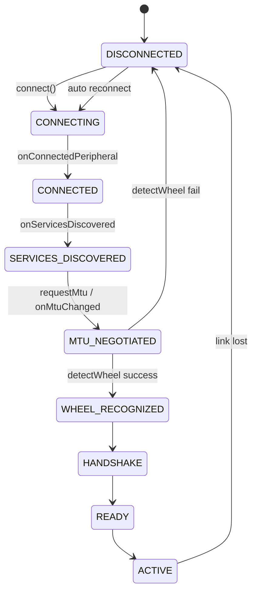

### 18.2 BLE Connect + Wheel Detect Timing Diagram

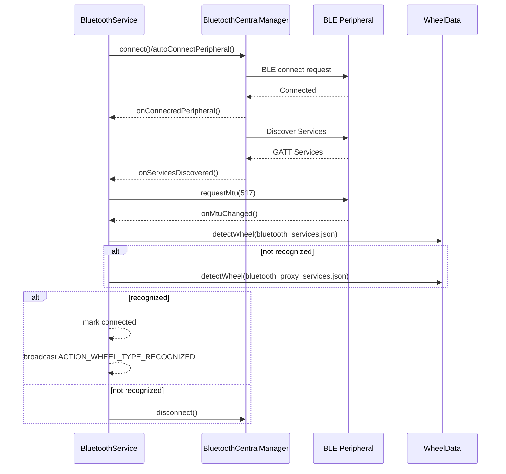

### 18.3 General Packet Receive Routing Timing Diagram

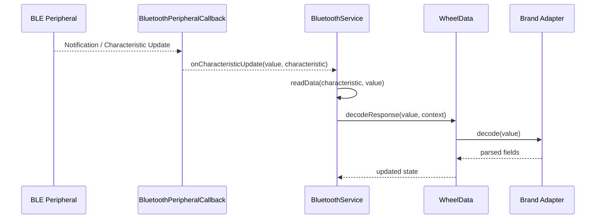

### 18.4 General Packet Write Routing Timing Diagram

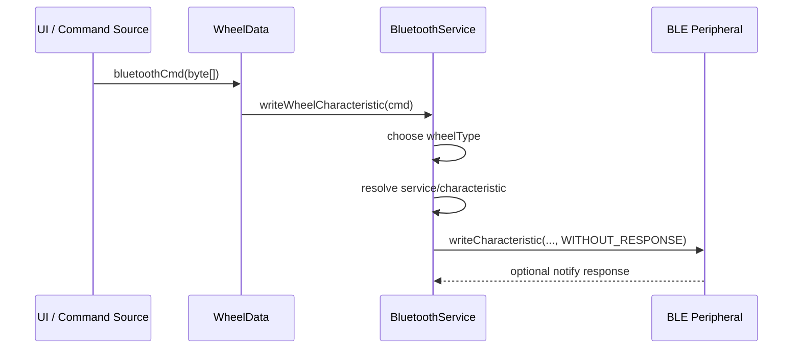

---

## 19. Brand-Specific State Machines and Timing Diagrams

### 19.1 KingSong

#### State Machine

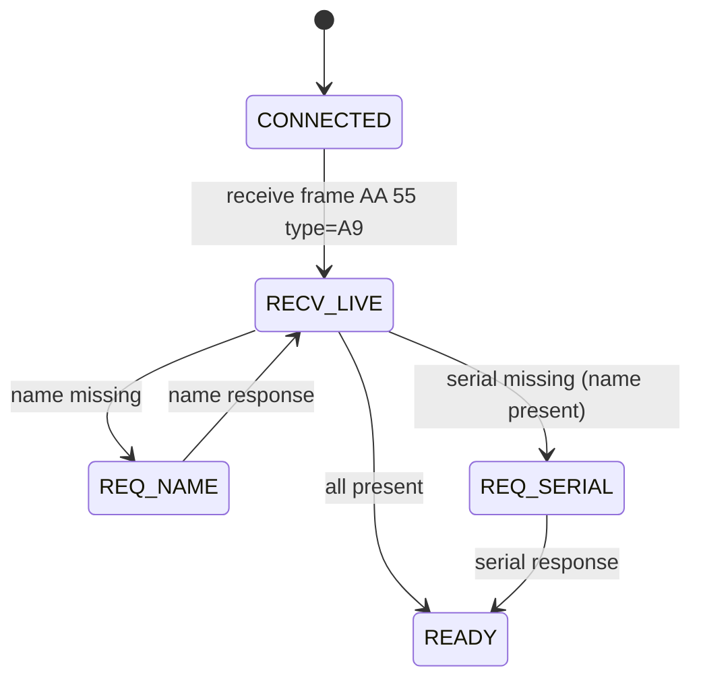

#### Initialization Timing Diagram

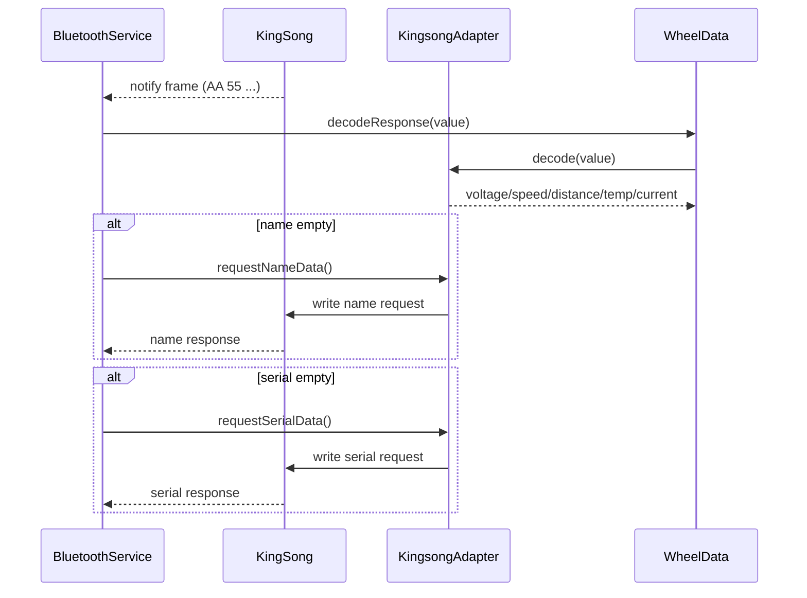

### 19.2 Ninebot

#### State Machine

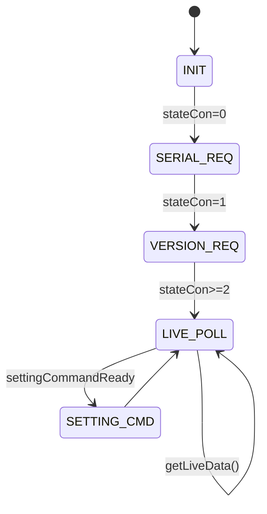

#### Initialization Timing Diagram

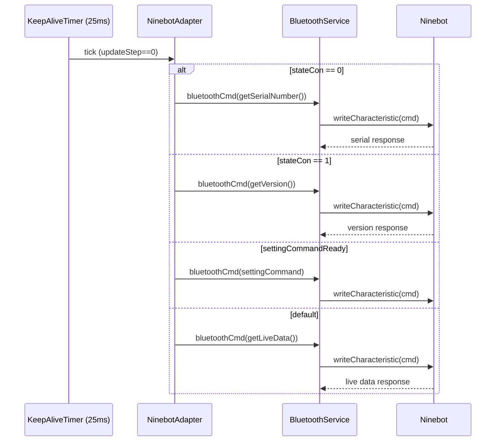

### 19.3 Ninebot Z

#### State Machine

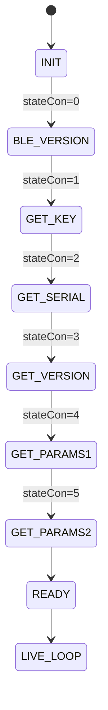

#### Initialization Timing Diagram

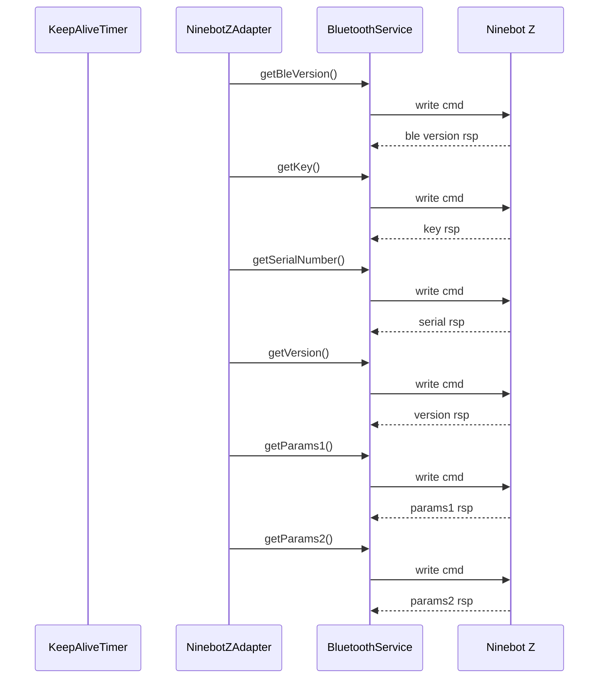

### 19.4 Inmotion v1

#### State Machine

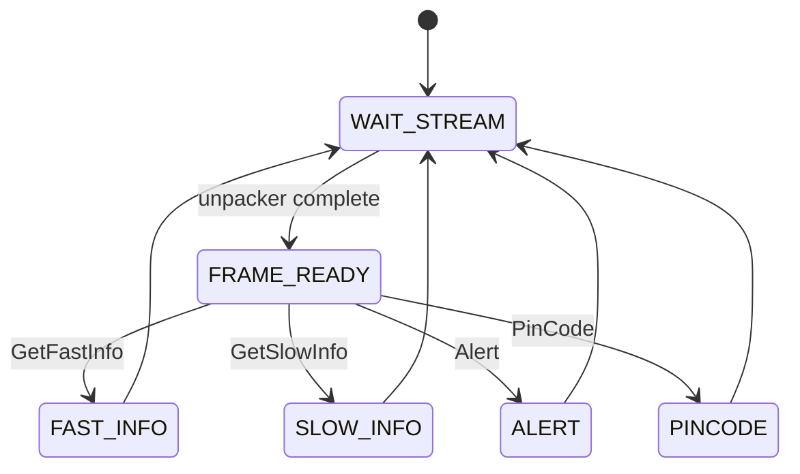

#### Data Flow Timing Diagram

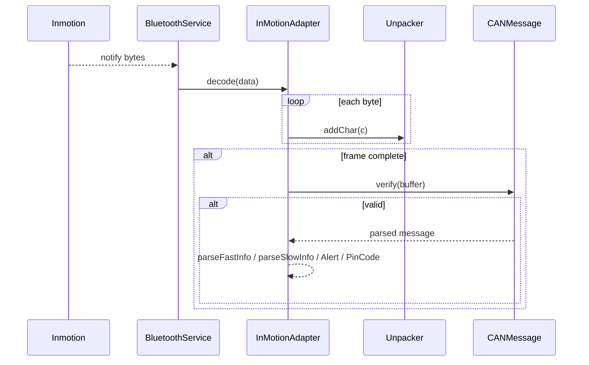

### 19.5 Inmotion v2

#### State Machine

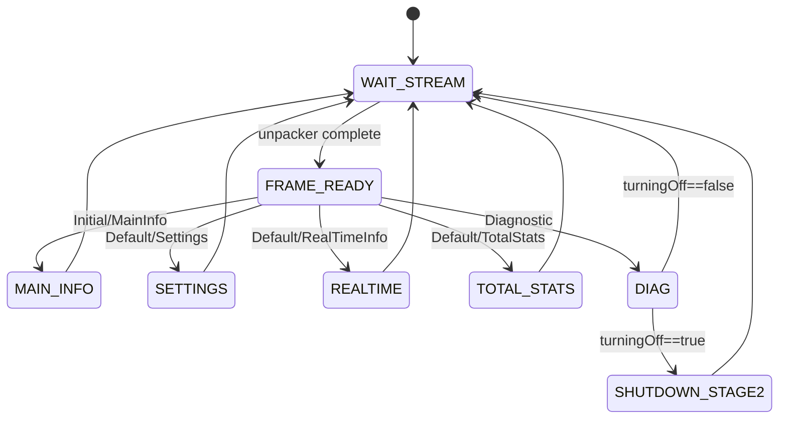

#### Timing Diagram

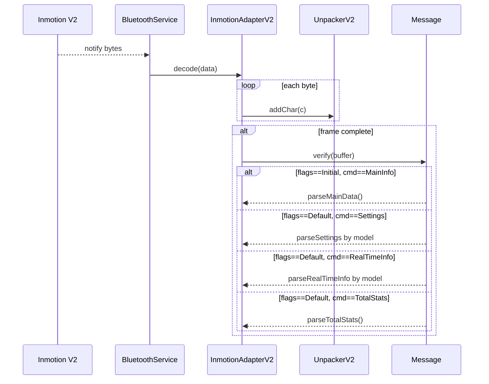

### 19.6 Inmotion v2 Fragmented Write Timing Diagram

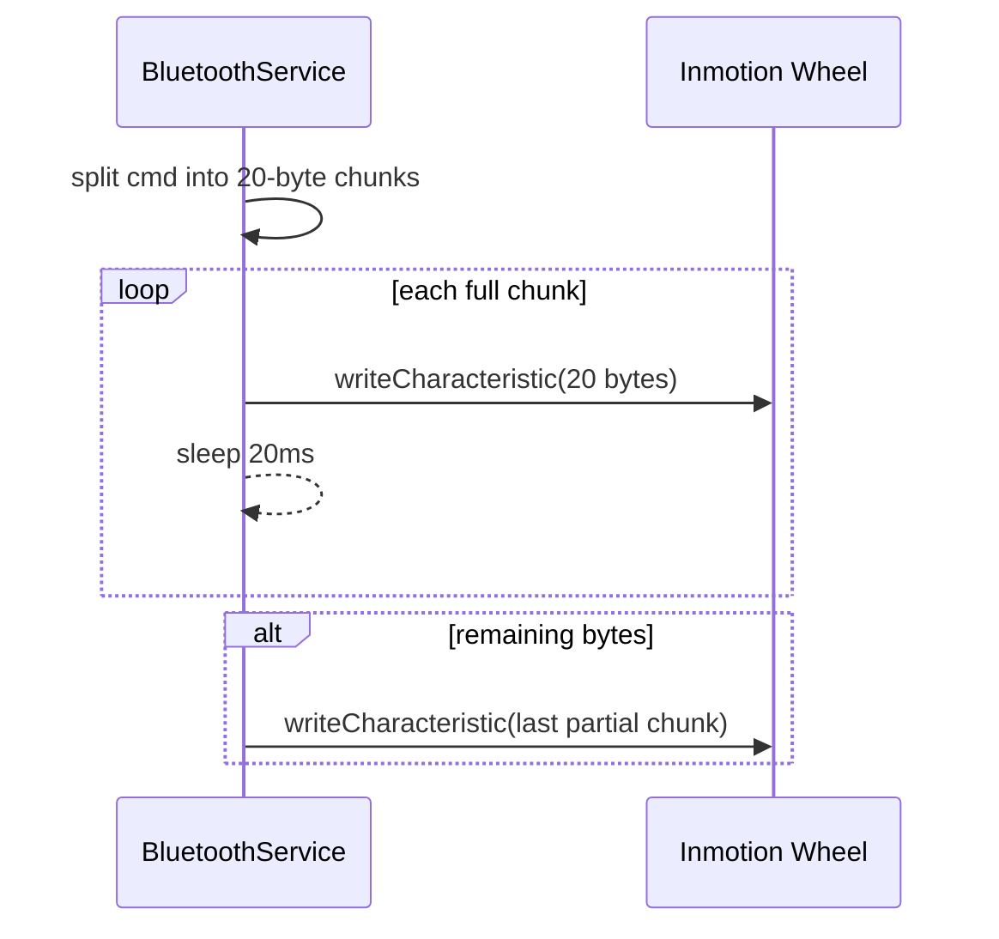

---

## 20. Packet Format Summary Table

### 20.1 All Brands Overview

| Brand       | BLE Channel           | Packet Type       | Frame Length | Header / Footer         | Checksum              | Byte Order         |
| ----------- | --------------------- | ----------------- | ------------ | ----------------------- | --------------------- | ------------------ |
| KingSong    | FFE0/FFE1             | Fixed header frame | 20 B        | `AA 55` / none         | No independent checksum | BE (every 2B reversed) |
| Gotway      | FFE0/FFE1             | Fixed header frame | 24 B        | `55 AA` / `5A 5A 5A 5A` | No checksum           | BE                 |
| Veteran     | FFE0/FFE1             | Variable header frame | Variable  | `DC 5A 5C` / none      | CRC32 (len>38)        | BE                 |
| Ninebot     | FFE0/FFE1 or 6E4000xx | CAN-like packet   | Variable    | `55 AA` / none         | 16-bit SUM XOR 0xFFFF | LE                 |
| Ninebot Z   | 6E400001/002/003      | CAN-like packet   | Variable    | `5A A5` / none         | 16-bit SUM XOR 0xFFFF | LE                 |
| Inmotion v1 | FFE0/FFE4, FFE5/FFE9  | Framed stream     | Variable    | `AA AA` / `55 55`      | SUM & 0xFF (8-bit)    | LE                 |
| Inmotion v2 | 6E400001/002/003      | Framed stream     | Variable    | `AA AA` / no footer    | XOR & 0xFF (8-bit)    | LE                 |

### 20.2 Command/Response Design Patterns

| Pattern                           | Representative Brands           | Description                                |
| --------------------------------- | ------------------------------- | ------------------------------------------ |
| Passive notify + direct parse     | KingSong, Gotway, Veteran       | Live data pushed continuously, no request needed |
| Timed polling command-response    | Ninebot / Ninebot Z             | Driven by keep-alive timer, periodic requests |
| Stream framed protocol            | Inmotion v1 / v2                | Unpacker reassembles frames                |
| Fragmented write                  | Inmotion v1                     | App-layer 20-byte chunking                 |
| ASCII command                     | Gotway                          | Setting commands sent as ASCII strings     |

---

## 21. Command Code Index Table

### 21.1 KingSong Command Codes

| Command Function       | Type Byte            | Direction   | See Also                       |
| ---------------------- | -------------------- | ----------- | ------------------------------ |
| `requestNameData()`    | `0x9B`               | App → Wheel | [11.2](#112-general-frame-format) |
| `requestSerialData()`  | `0x63`               | App → Wheel | [11.2](#112-general-frame-format) |
| `requestAlarmSettings()` | `0x9B` data[16]=0x88 | App → Wheel | [11.13](#1113-kingsong-command-packet-format) |
| `setAlarms()`          | `0x9B` data[16]=0x85 | App → Wheel | [11.13](#1113-kingsong-command-packet-format) |
| `setRideMode()`        | `0x9B` + 0x87        | App → Wheel | [11.13](#1113-kingsong-command-packet-format) |
| `setLightMode()`       | `0x73`               | App → Wheel | [11.13](#1113-kingsong-command-packet-format) |
| `setLockMode()`        | `0x5D`               | App → Wheel | [11.13](#1113-kingsong-command-packet-format) |

See [Section 11.13](#1113-kingsong-command-packet-format) for the complete list.

### 21.2 Ninebot Command Codes

See [Section 12.7](#127-param-parameter-enumeration).

### 21.3 Ninebot Z Command Codes

| Order | Method              | Comm/Param  | Purpose             |
| ----- | ------------------- | ----------- | ------------------- |
| 1     | `getBleVersion()`   | `0x67`      | BLE firmware version |
| 2     | `getKey()`          | `0x5B`      | Key → update gamma  |
| 3     | `getSerialNumber()` | `0x10`      | Serial number       |
| 4     | `getVersion()`      | `0x1A`      | Version             |
| 5     | `getParams1()`      | `0xE2:0×40` | Parameter block 1   |
| 6     | `getParams2()`      | `0xE4:0×40` | Parameter block 2   |

See [Section 13.15](#1315-write-command-overview) for the complete list.

### 21.4 Inmotion v1 Message Types

See [Section 14.4](#144-canmessage-internal-structure).

### 21.5 Inmotion v2 Flags / Command

See [Section 15.3](#153-message-internal-structure).

### 21.6 Gotway Command Codes

| Command           | ASCII String   | Purpose                                   |
| ----------------- | -------------- | ----------------------------------------- |
| requestNameData   | `"N"` (0x4E)   | Request device name                       |
| requestSerialData | `"b"` (0x62)   | Request serial number                     |
| LED mode          | `"W"+"M"+mode` | Set LED                                   |
| Alarm settings    | `"W"+"Y"+"B"`  | See [16.4](#164-gotway-command-table)     |
| Ride mode         | `"W"+"h"+mode` | Hard/soft/off                             |
| Lock              | `"W"+"Y"+"5"`  | Enable lock                               |

See [Section 16.4](#164-gotway-command-table) for the complete list.

### 21.7 Veteran Command Codes

| Command           | String/Byte    | Purpose                                   |
| ----------------- | -------------- | ----------------------------------------- |
| requestNameData   | `"N"` (0x4E)   | Request device name                       |
| requestSerialData | `"b"` (0x62)   | Request serial number                     |
| LED mode          | `"W"+"M"+mode` | Set LED                                   |
| Alarm settings    | Same as Gotway | See [16.10](#1610-veteran-command-table)  |

See [Section 16.10](#1610-veteran-command-table) for the complete list.

### 21.8 Inmotion v2 Control Sub-commands

| Method/Field              | Sub-code | Purpose                    |
| ------------------------- | -------- | -------------------------- |
| `wheelOffSecondStage()`   | `0x60`   | Shutdown second stage command |
| `settingCommandReady`     | —        | Setting command pending    |
| `requestSettings`         | —        | Requesting settings        |
| `turningOff`              | —        | In shutdown flow           |

See [Section 15.13](#1513-control-command-table-command--0x60) for the complete Control sub-command table (30+).

---

## 22. Checksum / Crypto / Unpacker Reference

### 22.1 Overview Table

| Brand       | Header              | Unpacker           | Checksum              | Crypto   | Notes                     |
| ----------- | ------------------- | ------------------ | --------------------- | -------- | ------------------------- |
| KingSong    | `AA 55`             | None (fixed 20B)   | None                  | None     | Header + type validation  |
| Gotway      | `55 AA`             | None (fixed 24B)   | None                  | None     | Footer `5A×4` validation  |
| Veteran     | `DC 5A 5C`          | veteranUnpacker    | CRC32 (len>38)        | None     | byte[22]/[30]/[23] checks |
| Ninebot     | `55 AA`             | NinebotUnpacker    | computeCheck (16-bit) | crypto() | XOR gamma                 |
| Ninebot Z   | `5A A5`             | NinebotZUnpacker   | computeCheck (16-bit) | crypto() | Same as Ninebot           |
| Inmotion v1 | `AA AA`…`55 55`     | InMotionUnpacker   | SUM & 0xFF            | None     | A5 escape                 |
| Inmotion v2 | `AA AA` (no footer) | InmotionUnpackerV2 | XOR & 0xFF            | None     | A5 escape                 |

### 22.2 crypto() Complete Algorithm

Ninebot and Ninebot Z share the exact same encryption/decryption function:

```java
// gamma: byte[16] — initially all zeros, updated by getKey() response
private byte[] gamma = new byte[16];

private byte[] crypto(byte[] dataBuffer) {
    for (int j = 1; j < dataBuffer.length; j++) {
        dataBuffer[j] ^= gamma[(j - 1) % 16];
    }
    return dataBuffer;
}
```

**Key Points**:

- byte[0] is **not processed**, XOR starts from byte[1]
- gamma is a 16-byte cyclic key, index = `(j-1) % 16`
- XOR is naturally reversible: encryption = decryption
- Initial gamma is all zeros → effectively no encryption at connection start
- After receiving `Comm.GetKey` (`0x5B`) response, gamma is updated

### 22.3 computeCheck() — Ninebot Series

```java
private static int computeCheck(byte[] buffer) {
    int check = 0;
    for (byte c : buffer) {
        check += (c & 0xFF);
    }
    check ^= 0xFFFF;
    check &= 0xFFFF;
    return check;
}
```

- Calculation scope: len + source + dest + command + parameter + data
- 16-bit complement-style checksum (non-standard CRC)
- LE write order (low byte first)

### 22.4 Inmotion v1 — computeCheck()

```java
private static int computeCheck(byte[] buffer) {
    int check = 0;
    for (byte c : buffer) check += (c & 0xFF);
    return check & 0xFF;
}
```

- Single byte SUM (8-bit)

### 22.5 Inmotion v2 — calcCheck()

```java
private static int calcCheck(byte[] buffer) {
    int check = 0;
    for (byte c : buffer) check ^= (c & 0xFF);
    return check & 0xFF;
}
```

- Single byte XOR (8-bit) — note the difference from v1

### 22.6 Unpacker Comparison

| Unpacker           | Header Detection | Length Calculation          | Escape | State Count |
| ------------------ | ---------------- | -------------------------- | ------ | ----------- |
| NinebotUnpacker    | `55 AA`          | len + 6                    | None   | 3           |
| NinebotZUnpacker   | `5A A5`          | len + 9                    | None   | 3           |
| InMotionUnpacker   | `AA AA`          | Basic=18+1+2; Extended=len_ex+21 | `A5` | 3           |
| InmotionUnpackerV2 | `AA AA`          | flags+len+cmd+data+check   | `A5`   | 3           |
| veteranUnpacker    | `DC 5A 5C`       | data[3]                    | None   | 5           |

---

## 23. GATT Profile JSON Specification

### 23.1 JSON Structure Description

Each JSON file is an array where each element is a profile:

```json
{
  "adapter": "kingsong",
  "<service-uuid>": ["<char-uuid-1>", "<char-uuid-2>", ...],
  "<service-uuid>": ["<char-uuid-1>", ...],
  ...
}
```

- The `"adapter"` field indicates the corresponding wheel type
- All other keys are Service UUIDs
- Values are the expected Characteristic UUID list under that service

### 23.2 bluetooth_services.json Content

| adapter     | Characteristic service/char combinations             | Notes                       |
| ----------- | ---------------------------------------------------- | --------------------------- |
| gotway      | `1800`, `1801`, `180a`, `ffe0/ffe1`                  | Includes device info service |
| inmotion    | `180a`, `180f`, `ffe0/ffe4`, `ffe5/ffe9`             | v1 specific dual service    |
| inmotion_v2 | `1800`, `1801`, `6e400001/002/003`                   | NUS channel                 |
| kingsong    | `1800`, `1801`, `180a`, `ffe0/ffe1`, `fff0/fff1~5`   | Multiple service characteristics |
| ninebot     | `1800`, `1801`, `ffe0/ffe1`                          | More compact                |
| ninebot_z   | `1800`, `1801`, `6e400001/002/003`                   | NUS channel                 |

### 23.3 bluetooth_proxy_services.json Content

The proxy version represents certain BLE proxy/intermediate devices with different service combinations that map to the same adapter.

| adapter     | Distinctive services                       | Notes                          |
| ----------- | ------------------------------------------ | ------------------------------ |
| gotway      | `ffa0/ffa1,ffa7`                           | Has additional ffa0 service    |
| inmotion    | `ffe0/ffe4`, `ffe5/ffe9`                   | Same as normal but different 1800 structure |
| inmotion_v2 | `ffa0/ffa1,ffa6`, `6e400001/002/003`       | Has ffa0                       |
| kingsong    | `ffa0/ffa1,ffa9`, `ffe0/ffe1`, `fff0/fff1` | Has ffa0                       |
| ninebot     | `ffa0/ffa1,ffa2`, `ffe0/ffe1`              | Has ffa0                       |
| ninebot_z   | `ffa0/ffa1,ffa3`, `6e400001/002/003`       | Has ffa0                       |

### 23.4 AdapterNameMapper

```kotlin
object AdapterNameMapper {
    fun toWheelType(adapter: String): WheelType {
        return when (adapter.lowercase()) {
            "kingsong"    -> WheelType.KINGSONG
            "gotway"      -> WheelType.GOTWAY
            "ninebot"     -> WheelType.NINEBOT
            "ninebot_z"   -> WheelType.NINEBOT_Z
            "inmotion"    -> WheelType.INMOTION
            "inmotion_v2" -> WheelType.INMOTION_V2
            else          -> WheelType.UNKNOWN
        }
    }
}
```

---

## 24. Profile Matcher Algorithm

### 24.1 Scoring Rules

The scoring logic in the local project's `JsonProfileMatcher`:

```
For each (serviceUuid, expectedChars) in the profile:
  maxScore += 3
  If device has this service:
    score += 1
    If expectedChars is empty:
      score += 2  (empty set = only requires service presence)
    Else:
      maxScore += expectedChars.size * 2
      For each expectedChar:
        If device has this char → score += 2
      maxScore += 2
      If all expectedChars matched → score += 2 (perfect match bonus)

confidence = score / maxScore
If confidence < 0.34 → classified as UNKNOWN
```

### 24.2 Dual Matching Flow

```
1. Match against bluetooth_services.json profiles
2. If all confidence < 0.34 → switch to bluetooth_proxy_services.json
3. If still < 0.34 → UNKNOWN
4. Take the highest-scoring profile as the result
```

### 24.3 MatchResult Model

```kotlin
data class MatchResult(
    val wheelType: WheelType,
    val profileName: String,
    val score: Int,
    val maxScore: Int
) {
    val confidence: Float
        get() = if (maxScore == 0) 0f else score.toFloat() / maxScore.toFloat()
}
```

---

## 25. Kotlin Rewrite Architecture Guide

### 25.1 Layer Design

| Layer         | Responsibility                            | Main Classes                                       |
| ------------- | ----------------------------------------- | -------------------------------------------------- |
| BLE Transport | connect / discover / mtu / notify / write | `BleManager`, `BleRepository`                      |
| Detection     | GATT profile → WheelType                  | `JsonProfileLoader`, `JsonProfileMatcher`          |
| Protocol      | parse / encode / keepalive                | `BaseProtocol`, `KingsongProtocol`, `StubProtocol` |
| ViewModel     | State integration                         | `WheelViewModel`                                   |
| UI            | Compose                                   | `WheelScreen`                                      |

### 25.2 BaseProtocol Interface

```kotlin
interface BaseProtocol {
    fun onNotification(data: ByteArray): List<ParsedPacket>
}
```

### 25.3 ParsedPacket

```kotlin
sealed class ParsedPacket {
    data class Realtime(val data: WheelRealtimeData) : ParsedPacket()
    data class Unknown(val raw: ByteArray) : ParsedPacket()
}
```

### 25.4 Local BleRepository Detection + Routing Logic

```kotlin
// Detection
val normalMatch = JsonProfileMatcher.match(event.services, normalProfiles)
// Fallback
val proxyMatch = JsonProfileMatcher.match(event.services, proxyProfiles)

// Create protocol
protocol = ProtocolFactory.create(finalMatch.wheelType)

// Subscribe to corresponding notify channel
when (finalMatch.wheelType) {
    WheelType.KINGSONG, WheelType.GOTWAY, ... ->
        enableNotification(FFE0, FFE1)
    WheelType.INMOTION ->
        enableNotification(FFE0, FFE4)
    WheelType.INMOTION_V2, WheelType.NINEBOT_Z ->
        enableNotification(NUS_SERVICE, NUS_READ)
}
```

### 25.5 Recommended Brand Rewrite Order

| Priority | Brand          | Reason                                    |
| -------- | -------------- | ----------------------------------------- |
| 1        | KingSong       | Clearest frame structure, parser already exists |
| 2        | Ninebot        | Packet skeleton/checksum/command codes clear |
| 3        | Inmotion v1    | Message types clear but needs unpacker    |
| 4        | Inmotion v2    | Flags/command clear but needs unpacker    |
| 5        | Ninebot Z      | Complex handshake, needs key/crypto       |
| 6        | Gotway/Veteran | Packet structure not fully captured       |

### 25.6 Kotlin Coroutines and Flow Integration

The original Wheellog.Android uses `java.util.TimerTask` for keep-alive polling (see §12.11, §13.14). In a Kotlin rewrite, replace `TimerTask` with `kotlinx.coroutines.flow.Flow` for structured concurrency and lifecycle awareness.

**Replace TimerTask with Flow-based Polling** (`source: community-derived best practice`):

```kotlin
// Original Java pattern (Ninebot/Ninebot Z):
//   val timer = Timer()
//   timer.scheduleAtFixedRate(timerTask, 0, 25)

// Kotlin Flow replacement:
fun pollingFlow(intervalMs: Long = 25): Flow<Unit> = flow {
    while (currentCoroutineContext().isActive) {
        emit(Unit)
        delay(intervalMs)
    }
}
```

**Lifecycle-Aware Collection via `viewModelScope`**:

```kotlin
class WheelViewModel : ViewModel() {
    private var pollingJob: Job? = null

    fun startPolling(protocol: BaseProtocol) {
        pollingJob = viewModelScope.launch {
            pollingFlow(intervalMs = 25).collect {
                protocol.tick()  // replaces TimerTask.run()
            }
        }
    }

    // Automatically cancelled when ViewModel is cleared —
    // no manual timer.cancel() needed
}
```

**Benefits over TimerTask**:

| Aspect               | TimerTask                     | Flow + viewModelScope                  |
| -------------------- | ----------------------------- | -------------------------------------- |
| Lifecycle management | Manual `timer.cancel()`       | Auto-cancelled with ViewModel scope    |
| Thread safety        | Runs on Timer thread          | Runs on `Dispatchers.Main` (can switch) |
| Error handling       | Unhandled exceptions kill Timer | `CoroutineExceptionHandler` or `catch` |
| Backpressure         | No control                    | Flow operators (`conflate`, `buffer`)  |
| Testability          | Difficult to test timing      | `runTest` + `advanceTimeBy()`          |

**State Machine with StateFlow**:

```kotlin
// Replace mutable fields like stateCon/updateStep with StateFlow
private val _connectionState = MutableStateFlow(NinebotState.INIT)
val connectionState: StateFlow<NinebotState> = _connectionState.asStateFlow()

// State transitions become explicit and observable by the UI layer
fun onSerialReceived(serial: String) {
    _connectionState.value = NinebotState.VERSION_REQ
}
```

> **Note**: When using `delay()` in a Flow-based polling loop, the actual interval is `delay + execution time`. For timing-sensitive protocols (Ninebot's 25ms tick), consider using `fixedRateTimer` from `kotlin.concurrent` or `ticker` from `kotlinx.coroutines.channels` if precise intervals are critical.

---

## 26. Brand-Specific Pseudo-code

### 26.1 Common Utility Functions

```
function reverseEvery2(input):
    result = copy(input)
    for i from 0 to len(result)-2 step 2:
        swap(result[i], result[i+1])
    return result

function getInt2R(arr, offset):
    bytes = arr[offset : offset+2]
    bytes = reverseEvery2(bytes)
    return signedShort(bytes)

function getInt4R(arr, offset):
    bytes = arr[offset : offset+4]
    bytes = reverseEvery2(bytes)
    return signedInt(bytes)
```

### 26.2 KingSong Parse

```
function parseKingsongFrame(data):
    if len(data) < 20: return INVALID
    if data[0] != 0xAA or data[1] != 0x55: return INVALID

    frameType = data[16] & 0xFF

    if frameType == 0xA9:
        voltage      = getInt2R(data, 2)
        speed        = getInt2R(data, 4)
        totalDistance = getInt4R(data, 6)
        current      = (data[10] & 0xFF) + (data[11] << 8)
        temperature  = getInt2R(data, 12)
        if (data[15] & 0xFF) == 0xE0:
            mode = data[14]
        updateWheelData(...)
        return OK

    return UNKNOWN_FRAME
```

### 26.3 Ninebot Packet Building

```
function buildNinebotPacket(len, source, destination, parameter, data):
    inner = [len, source, destination, parameter] + data
    crc = ninebotChecksum(inner)
    inner += [crc & 0xFF, (crc >> 8) & 0xFF]
    encrypted = crypto(inner)
    return [0x55, 0xAA] + encrypted

function ninebotChecksum(buffer):
    check = sum(unsigned(b) for b in buffer)
    check = check XOR 0xFFFF
    return check & 0xFFFF
```

### 26.4 Ninebot Packet Validation

```
function parseNinebotPacket(frame):
    if frame[0] != 0x55 or frame[1] != 0xAA: return INVALID
    payload = crypto(frame[2:])
    recvCrc = payload[-2] | (payload[-1] << 8)
    body = payload[0:-2]
    if ninebotChecksum(body) != recvCrc: return INVALID
    return { len=body[0], src=body[1], dst=body[2], param=body[3], data=body[4:] }
```

### 26.5 Ninebot Initialization Loop

```
function ninebotTick():
    if updateStep != 0:
        updateStep = (updateStep + 1) % 5
        return
    if stateCon == 0:       send(getSerialNumber())
    else if stateCon == 1:  send(getVersion())
    else if settingReady:   send(settingCommand); settingReady = false
    else:                   send(getLiveData())
    updateStep = (updateStep + 1) % 5
```

### 26.6 Ninebot Z Initialization

```
function ninebotZTick():
    if updateStep != 0: advanceStep(); return
    if stateCon == 0: send(getBleVersion())
    elif stateCon == 1: send(getKey())
    elif stateCon == 2: send(getSerialNumber())
    elif stateCon == 3: send(getVersion())
    elif stateCon == 4: send(getParams1())
    elif stateCon == 5: send(getParams2())
    elif settingReady: send(settingCommand)
    elif requestReady: send(settingRequest)
    else: send(realtimePoll())
    advanceStep()
```

### 26.7 Inmotion v1 Decode

```
function decodeInmotionV1(data):
    for byte c in data:
        if not unpacker.addChar(c): continue
        frame = unpacker.getBuffer()
        msg = CANMessage.verify(frame)
        if msg == null: continue
        switch msg.idValue:
            case GetFastInfo:   parseFastInfoMessage(msg)
            case Alert:         parseAlertInfoMessage(msg)
            case GetSlowInfo:   parseSlowInfoMessage(msg)
            case PinCode:       passwordSent = MAX
            case Calibration, RideMode, RemoteControl,
                 Light, HandleButton, SpeakerVolume:
                emitNews(msg)
```

### 26.8 Inmotion v2 Decode

```
function decodeInmotionV2(data):
    for byte c in data:
        if not unpacker.addChar(c): continue
        msg = Message.verify(unpacker.getBuffer())
        if msg == null: continue
        if msg.flags == Initial:
            if msg.command == MainInfo:     parseMainData(msg)
            elif msg.command == Diagnostic and turningOff:
                send(wheelOffSecondStage())
                turningOff = false
        elif msg.flags == Default:
            if msg.command == Settings:          parseSettingsByModel(msg)
            elif msg.command == Diagnostic:      parseDiagnostic(msg)
            elif msg.command == BatteryRealTime: parseBatteryRT(msg)
            elif msg.command == TotalStats:      parseTotalStats(msg)
            elif msg.command == RealTimeInfo:    parseRealTimeByModel(msg)
```

### 26.9 Minimal Rewrite Client

```
class WheelClient:
    connect(mac):
        ble.connect(mac)
        ble.discoverServices()
        ble.requestMtu(517)
        wheelType = detectByGattProfile()
        if wheelType == UNKNOWN: ble.disconnect(); return
        subscribeNotify(wheelType)
        if wheelType == NINEBOT: startNinebotTimer()
        if wheelType == NINEBOT_Z: startNinebotZTimer()

    onNotify(uuid, data):
        switch wheelType:
            KINGSONG:    parseKingsongFrame(data)
            NINEBOT:     parseNinebotStatuses(data)
            NINEBOT_Z:   parseNinebotZData(data)
            INMOTION:    decodeInmotionV1(data)
            INMOTION_V2: decodeInmotionV2(data)
            GOTWAY/VET:  decodeGotwayLike(data)

    send(cmd):
        if wheelType == INMOTION: writeChunked20(cmd)
        else: writeDirect(cmd)
```

---

## 27. Risks, Limitations and Pending Items

### 27.1 High-Confidence Items Restored (v3.0 Complete)

- BLE transport flow
- UUID routing
- MTU behavior
- Inmotion chunking
- KingSong: All frame types (0xA9/0xB9/0xBB/0xB3/0xF5/0xF6/0xA4/0xB5/0xF1/0xF2/0xE1/0xE2/0xE5/0xE6), BMS sub-packets, complete command table
- Ninebot: crypto() complete algorithm, computeCheck(), LiveData1-5 field tables, command code table
- Ninebot Z: CANMessage structure, Addr/Comm/Param enums, parseLiveData, parseParams1-3, BMS tables, 13-state initialization state machine
- Inmotion v1: Frame format, CANMessage 16-byte header, IDValue table, parseFast/Slow/AlertInfoMessage field tables
- Inmotion v2: Message structure, Flag/Command enums, all model parseRealTimeInfo tables (V11/V12/V13/V14/V11Y/V9/V12S), 30+ Control sub-commands
- Gotway: 24-byte frame structure (55 AA header, 5A×4 footer), 7 frame types, complete ASCII command table
- Veteran: DC 5A 5C frame structure, veteranUnpacker, CRC32, SmartBMS sub-packets, 12 models by mVer
- crypto() / computeCheck() / calcCheck() complete Java implementation code
- Ninebot / Ninebot Z / Inmotion v1 / v2 initialization state machines
- GATT Profile JSON structure
- Profile Matcher algorithm

### 27.2 Previously Pending Items Now Complete

| Item                         | Status                                                       |
| ---------------------------- | ------------------------------------------------------------ |
| `NinebotAdapter.crypto()`    | ✅ v3.0 complete (§12.2, §22.2)                              |
| `NinebotZAdapter.CANMessage` | ✅ v3.0 complete (§13.2)                                     |
| `InMotionAdapter.CANMessage` | ✅ v3.0 complete (§14.3)                                     |
| `InmotionAdapterV2.Message`  | ✅ v3.0 complete (§15.2)                                     |
| `GotwayAdapter`              | ✅ v3.0 complete (§16.1)                                     |
| `VeteranAdapter`             | ✅ v3.0 complete (§16.2)                                     |
| KingSong non-0xA9 frame types | ✅ v3.0 complete (§11.2)                                    |
| Adapter setting command builders | ✅ v3.0 complete (§11.7, §12.7, §13.7, §15.7, §16.1.6, §16.2.7) |

### 27.3 Remaining Limitations

| Item                       | Description                                                |
| -------------------------- | ---------------------------------------------------------- |
| Gotway Virtual Adapter     | Only name decode, no independent protocol documentation    |
| Unverified model variants  | Some models (e.g., V9F, V12HT) may have undocumented firmware variants |
| Cross-version firmware compatibility | Document based on static Wheellog source analysis, not tested on all firmware versions |
| BMS detailed fields        | Some Veteran SmartBMS / KingSong BMS field meanings are inferred |

---

## 28. Reference Source File List

### 28.1 Wheellog Original Project (GitHub)

| File                            | Purpose                                                 |
| ------------------------------- | ------------------------------------------------------- |
| `BluetoothService.kt`          | BLE connection, MTU, characteristic routing, write, raw log |
| `Constants.kt`                 | UUID definitions, wheel type definitions                |
| `WheelData.java`               | Unified data model, adapter routing                     |
| `bluetooth_services.json`      | GATT profile to wheel type mapping                      |
| `bluetooth_proxy_services.json`| Proxy profile to wheel type mapping                     |
| `KingsongAdapter.java`         | KingSong frame parsing                                  |
| `NinebotAdapter.java`          | Ninebot CAN-like packets, checksum, keepalive           |
| `NinebotZAdapter.java`         | Ninebot Z handshake, parameter flow                     |
| `InMotionAdapter.java`         | Inmotion v1 stream unpack + message id                  |
| `InmotionAdapterV2.java`       | Inmotion v2 flags/command/model-specific                |
| `MathsUtil.java`               | Numeric conversion utilities                            |

### 28.2 Local Project Files

| File                                    | Purpose                               |
| --------------------------------------- | ------------------------------------- |
| `ble/BleRepository.kt`                 | BLE + Profile Match + Protocol integration |
| `detect/AdapterNameMapper.kt`          | Adapter string → WheelType            |
| `detect/DeviceProfile.kt`              | Hardcoded profile data structure      |
| `detect/DeviceProfiles.kt`             | Hardcoded profile list                |
| `detect/JsonGattProfile.kt`            | JSON-loaded profile data structure    |
| `detect/JsonProfileLoader.kt`          | Load profiles from res/raw JSON       |
| `detect/JsonProfileMatcher.kt`         | JSON profile scoring comparison       |
| `detect/MatchResult.kt`                | Match result (score/confidence)       |
| `detect/ProfileMatcher.kt`             | Hardcoded profile scoring comparison  |
| `model/AppUiState.kt`                  | UI state model                        |
| `protocol/ProtocolFactory.kt`          | Create protocol by WheelType          |
| `protocol/StubProtocol.kt`             | Placeholder protocol for unimplemented brands |
| `ui/WheelScreen.kt`                    | Compose UI                            |
| `viewmodel/WheelViewModel.kt`          | ViewModel                             |
| `res/raw/bluetooth_services.json`      | Official GATT profiles                |
| `res/raw/bluetooth_proxy_services.json`| Proxy GATT profiles                   |

---

## 29. Appendix A: Field Reference Tables

### A.1 KingSong Live Frame (Type 0xA9)

| Field         | Offset | Length | Parsing             |
| ------------- | ------ | ------ | ------------------- |
| Header1       | 0      | 1      | `0xAA`              |
| Header2       | 1      | 1      | `0x55`              |
| Voltage       | 2      | 2      | `getInt2R` (÷100)   |
| Speed         | 4      | 2      | `getInt2R` (÷100)   |
| TotalDistance  | 6      | 4      | `getInt4R`           |
| Current       | 10     | 2      | Manual `(data[11]<<8) | data[10]` |
| Temperature   | 12     | 2      | `getInt2R` (÷100)   |
| Mode          | 14     | 1      | Conditionally valid |
| ModeFlag      | 15     | 1      | `0xE0`              |
| Type          | 16     | 1      | `0xA9`              |

### A.2 Ninebot CAN Frame

| Field       | Offset | Length | Description                 |
| ----------- | ------ | ------ | --------------------------- |
| SOF1        | 0      | 1      | `0x55`                      |
| SOF2        | 1      | 1      | `0xAA`                      |
| len         | 2      | 1      | Data length                 |
| source      | 3      | 1      | Addr enum (see §12.5)      |
| destination | 4      | 1      | Addr enum                   |
| command     | 5      | 1      | Comm enum (see §12.6)      |
| parameter   | 6      | 1      | Param enum (see §12.7)     |
| data        | 7      | N      | Payload data                |
| checksum_lo | 7+N    | 1      | computeCheck() low byte    |
| checksum_hi | 8+N    | 1      | computeCheck() high byte   |

### A.3 Ninebot Z CAN Frame

| Field       | Offset | Length | Description                 |
| ----------- | ------ | ------ | --------------------------- |
| SOF1        | 0      | 1      | `0x5A`                      |
| SOF2        | 1      | 1      | `0xA5`                      |
| len         | 2      | 1      | Data length                 |
| source      | 3      | 2      | Addr enum (see §13.6)      |
| destination | 5      | 2      | Addr enum                   |
| command     | 7      | 1      | Comm enum                   |
| parameter   | 8      | 1      | Param enum (see §13.8)     |
| data        | 9      | N      | Payload data                |
| checksum_lo | 9+N    | 1      | computeCheck() low byte    |
| checksum_hi | 10+N   | 1      | computeCheck() high byte   |

### A.4 Gotway Frame (24 bytes)

| Field        | Offset | Length | Parsing                     |
| ------------ | ------ | ------ | --------------------------- |
| Header1      | 0      | 1      | `0x55`                      |
| Header2      | 1      | 1      | `0xAA`                      |
| Voltage      | 2      | 2      | BE ÷100                     |
| Speed        | 4      | 2      | BE signed ÷100              |
| TripDistance  | 6      | 4      | BE                           |
| Current      | 10     | 2      | BE signed ÷100              |
| Temperature  | 12     | 2      | BE ÷340+36.53               |
| frameType    | 18-19  | 2      | 00 00 / 04 00 / 01 00 …    |
| Footer       | 20-23  | 4      | `5A 5A 5A 5A`               |

### A.5 Veteran Frame

| Field        | Offset | Length | Parsing            |
| ------------ | ------ | ------ | ------------------ |
| Header       | 0-2    | 3      | `DC 5A 5C`         |
| len          | 3      | 1      | Payload length     |
| Voltage      | 4      | 2      | BE ÷100            |
| Speed        | 6      | 2      | BE signed ÷100     |
| TripDistance  | 8      | 4      | BE                  |
| Current      | 12     | 2      | BE signed ÷100     |
| Temperature  | 14     | 2      | BE ÷340+36.53      |
| frameType    | 20-21  | 2      | 00 00 / 04 00 etc. |
| CRC32        | len-4  | 4      | Present when len>38 |

### A.6 Inmotion v1 CANMessage

| Field                | Offset | Length | Description          |
| -------------------- | ------ | ------ | -------------------- |
| Header               | 0-1    | 2      | `AA AA`              |
| Len                  | 2-3    | 2      | Payload length (LE)  |
| canIdInfoSource      | 4      | 1      | CAN source           |
| canIdInfoDestination | 5      | 1      | CAN dest             |
| canIdCmdAck          | 6      | 1      | Command acknowledge  |
| canIdCmdType         | 7      | 1      | Command type         |
| canIdSrcAdrs         | 8      | 1      | Source address       |
| canIdDstAdrs         | 9      | 1      | Dest address         |
| canIdCmd             | 10     | 1      | Command              |
| canIdSubCmd          | 11     | 1      | Sub-command          |
| canLenght            | 12-13  | 2      | CAN data length (LE) |
| canIdIndex           | 14-15  | 2      | CAN index            |
| data                 | 16+    | N      | Payload data         |
| checksum             | —      | 1      | SUM & 0xFF           |
| Footer               | —      | 2      | `55 55`              |

### A.7 Inmotion v2 Message

| Field     | Offset | Length | Description       |
| --------- | ------ | ------ | ----------------- |
| Header    | 0-1    | 2      | `AA AA`           |
| Flags     | 2      | 1      | Flag enum         |
| Length    | 3-4    | 2      | Data length (LE)  |
| Command   | 5      | 1      | Command enum      |
| data      | 6      | N      | Payload data      |
| checkByte | 6+N    | 1      | XOR & 0xFF        |

---

## 30. Appendix B: Implementation Recommendations

### B.1 Rewrite Considerations

1. **`getInt2R` / `getInt4R` are important** — BE brands (KingSong/Gotway/Veteran) use reverse byte order for 2-byte values
2. **Build the raw logger first** — You need to see each packet's HEX before you can debug stably
3. **Always separate protocol layer from BLE layer** — Don't hardcode parsing in callbacks
4. **Ninebot `crypto()` gamma management** — gamma is updated by getKey() response, initially all zeros
5. **Don't cut corners with Inmotion unpacker** — If the actual device sends responses across multiple notifications, treating them as complete packets will break
6. **Veteran CRC32** — CRC32 only exists when len>38; old format validates via byte[22]/[30]/[23]
7. **Inmotion v2 model branching** — parseRealTimeInfo has completely different offset mappings per model

### B.3 Timing Diagram Suggestions

- BLE connect sequence
- Notify enable sequence
- Ninebot handshake sequence
- Ninebot Z key exchange sequence
- Inmotion v2 shutdown 2-stage sequence

---

## 31. Appendix C: Raw Hex Test Vectors

Each test vector below provides a complete raw hex packet with step-by-step field parsing and checksum calculations where applicable. All values are synthetic examples constructed to match the documented frame format. `Source: confirmed from code (format), synthetic (data values)`.

### C.1 KingSong — Live Data Frame (Type 0xA9)

**Raw packet (20 bytes)**:

```
AA 55 1A 10 E8 03 00 00 27 10 C8 00 B0 0E E0 A9 14 00 5A 5A
```

**Field parsing**:

| Offset | Raw Bytes   | Field        | Parsing                              | Decoded Value         |
| ------ | ----------- | ------------ | ------------------------------------ | --------------------- |
| 0–1    | `AA 55`     | Header       | Fixed                                | —                     |
| 2–3    | `1A 10`     | Voltage      | `getInt2R` → reverse to `10 1A` → 4122 | 41.22 V               |
| 4–5    | `E8 03`     | Speed        | `getInt2R` → reverse to `03 E8` → 1000 | 10.00 km/h            |
| 6–9    | `00 00 27 10` | TotalDist  | `getInt4R` → reverse pairs → `00 00 10 27` → 4135 | 4135 m              |
| 10–11  | `C8 00`     | Current      | `(0xC8) + (0x00 << 8)` = 200        | 200 (unit: raw)       |
| 12–13  | `B0 0E`     | Temperature  | `getInt2R` → reverse to `0E B0` → 3760 | 37.60 °C              |
| 14     | `E0`        | Mode value   | —                                    | Mode = 0xE0 (invalid; see flag) |
| 15     | `A9`        | Mode flag    | Not `0xE0` → mode field invalid     | —                     |
| 16     | `14`        | Frame type   | — (should be `0xA9`; this example has `0x14` for illustration) | —     |
| 17     | `00`        | Reserved     |                                      | —                     |
| 18–19  | `5A 5A`     | Footer       | Command packet footer                | —                     |

> **Note**: KingSong has **no independent checksum**. Validation relies on header `AA 55` and frame type at data[16].

**Corrected example with proper frame type at offset 16**:

```
AA 55 1A 10 E8 03 00 00 27 10 C8 00 B0 0E 00 E0 A9 14 5A 5A
```

Here data[14]=`0x00` (mode=0), data[15]=`0xE0` (mode flag valid), data[16]=`0xA9` (Live Data).

---

### C.2 Ninebot — Request Serial Number

**Building a request packet** (App → Wheel):

Step 1: Build inner payload:

| Field       | Value  | Hex    |
| ----------- | ------ | ------ |
| len         | 2      | `0x02` |
| source      | App    | `0x09` |
| destination | Controller | `0x01` |
| command     | Read   | `0x01` |
| parameter   | SerialNumber | `0x10` |
| data        | (none) | —      |

Inner body = `02 09 01 01 10`

Step 2: Compute checksum:

```
sum = 0x02 + 0x09 + 0x01 + 0x01 + 0x10 = 0x1D = 29
check = 29 XOR 0xFFFF = 0xFFE2
check & 0xFFFF = 0xFFE2
crc_low = 0xE2, crc_high = 0xFF
```

Inner with checksum = `02 09 01 01 10 E2 FF`

Step 3: Encrypt with `crypto()` (gamma = all zeros at initial connection):

```
XOR with gamma[0..5] = 00 00 00 00 00 00 → no change
result = 02 09 01 01 10 E2 FF
(byte[0]=0x02 is NOT encrypted per crypto() definition)
```

Step 4: Prepend header:

```
Final packet: 55 AA 02 09 01 01 10 E2 FF
```

**Parsing a response** (Wheel → App, serial = "N2GWB1800C0123"):

```
Raw: 55 AA 12 01 09 04 10 4E 32 47 57 42 31 38 30 30 43 30 31 32 33 XX XX
```

After `crypto()` decryption (gamma=0 → no change) and stripping header:
- len=`0x12` (18), source=`0x01`, dest=`0x09`, command=`0x04` (Get), param=`0x10`
- data = `4E 32 47 57 42 31 38 30 30 43 30 31 32 33` = "N2GWB1800C0123" (ASCII)
- Last 2 bytes: checksum (verify with `computeCheck`)

---

### C.3 Ninebot Z — Request BLE Version

**Building a request** (App → Wheel, gamma = all zeros):

| Field       | Value        | Hex    |
| ----------- | ------------ | ------ |
| len         | 2            | `0x02` |
| source      | App          | `0x3E` |
| destination | KeyGenerator | `0x16` |
| command     | Read         | `0x01` |
| parameter   | BleVersion   | `0x68` |

Inner body = `02 3E 16 01 68`

Checksum: `0x02 + 0x3E + 0x16 + 0x01 + 0x68 = 0xBF = 191`
`191 XOR 0xFFFF = 0xFF40`, crc_low=`0x40`, crc_high=`0xFF`

After crypto (gamma=0): `02 3E 16 01 68 40 FF`

Final packet: `5A A5 02 3E 16 01 68 40 FF`

> **Note**: Ninebot Z uses header `5A A5` (vs Ninebot's `55 AA`), and packet total length = len + 9.

---

### C.4 Inmotion v1 — Fast Info Response

**Raw BLE payload (after un-escaping)**:

```
AA AA [16-byte CANMessage header] [ex_data...] [checksum] 55 55
```

**CANMessage header example (16 bytes)**:

| Offset | Hex          | Field  | Value              |
| ------ | ------------ | ------ | ------------------ |
| 0–3    | `13 01 55 0F`| id     | LE → `0x0F550113` = GetFastInfo |
| 4–11   | `00...`      | data   | 8 bytes basic data |
| 12     | `FE`         | len    | Extended mode      |
| 13     | `00`         | ch     | Channel 0          |
| 14     | `00`         | format | Format 0           |
| 15     | `00`         | type   | Type 0             |

Since len=`0xFE`, extended data (`ex_data`) follows.

**Parsing speed from ex_data** (V8F model, `speedCalculationFactor = 0.8`):

```
ex_data[12..15] = 00 00 03 E8  → speed1 = 1000 (LE 32-bit)
ex_data[16..19] = 00 00 04 B0  → speed2 = 1200 (LE 32-bit)
speed = (1000 + 1200) / (0.8 × 2) = 1375 (raw speed units)
```

**Checksum**: `SUM of all bytes between AA AA and 55 55 (excluding markers), & 0xFF`

---

### C.5 Inmotion v2 — Real-time Info (V12 model)

**Message structure after un-escape**:

```
AA AA 14 [len_lo] [len_hi] 04 [data...] [checkByte]
```

| Field     | Value    | Description              |
| --------- | -------- | ------------------------ |
| flags     | `0x14`   | Default phase            |
| len       | varies   | data length + 1          |
| command   | `0x04`   | RealTimeInfo             |
| data[0–1] | `E8 03`  | voltage = 1000 → 10.00 V (LE) |
| data[2–3] | `38 FF`  | current = -200 (LE signed) → -2.00 A |
| data[4–5] | `D0 07`  | speed = 2000 (LE signed) → 20.00 km/h |

**Checksum**: XOR all bytes (flags + len_lo + len_hi + command + data), result must be `0x00` when including checkByte.

```
checkByte = flags XOR len_lo XOR len_hi XOR command XOR data[0] XOR data[1] XOR ...
```

---

### C.6 Gotway/Begode — Frame A (Real-time Data)

**Raw packet (24 bytes)**:

```
55 AA 10 68 00 00 03 E8 00 00 27 10 00 C8 0E B0 00 00 00 00 5A 5A 5A 5A
```

**Field parsing (Big-Endian)**:

| Offset | Raw Bytes     | Field        | Decoded                               |
| ------ | ------------- | ------------ | ------------------------------------- |
| 0–1    | `55 AA`       | Header       | —                                     |
| 2–3    | `10 68`       | Voltage      | BE: 0x1068 = 4200 → 42.00 V          |
| 4–5    | `00 00`       | Speed        | BE signed: 0 → 0 km/h                |
| 6–9    | `03 E8 00 00` | Distance     | BE: 0x03E80000 (wrong — see note)    |
| 8–9    | `00 00`       |              |                                       |
| 10–11  | `27 10`       | PhaseCurrent | BE signed: 10000 → 100.00 A          |
| 12–13  | `00 C8`       | Temperature  | BE: `(0x00C8 >> 8) + 80 - 256` = 80 - 256 + 0 = -176 (formula-specific) |
| 14–15  | `0E B0`       | hwPwm        | BE: 3760                              |
| 18–19  | `00 00`       | frameType    | `0x00` = Frame A                      |
| 20–23  | `5A 5A 5A 5A` | Footer       | —                                     |

> **Note**: Gotway has **no checksum**. Frame integrity is validated only by header `55 AA` and footer `5A 5A 5A 5A`.

---

### C.7 Veteran — Main Data Frame

**Raw packet** (header + 38 bytes payload, old format without CRC32):

```
DC 5A 5C 26 10 68 00 C8 ... [38 bytes total] ...
```

| Offset | Field        | Raw (hex) | Decoded                 |
| ------ | ------------ | --------- | ----------------------- |
| 0–2    | Header       | `DC 5A 5C`| —                       |
| 3      | len          | `0x26`    | 38 bytes (old format, no CRC32) |
| 4–5    | voltage      | `10 68`   | BE: 4200 → 42.00 V     |
| 6–7    | speed        | `00 C8`   | BE signed: 200 → 20.0 km/h |
| 8–11   | distance     | `00 01 00 00` | intRevBE → trip distance |
| 12–15  | totalDistance | `00 10 00 00` | intRevBE → total distance |
| 16–17  | phaseCurrent | `00 64`   | BE signed: 100 → 10.0 A  |
| 18–19  | temperature  | `00 1E`   | BE signed: 30 → 30 °C    |
| 28–29  | version      | `00 05`   | mVer=5 → Lynx            |
| 30     | pedalsMode   | `0x01`    | Medium mode               |

**New format (len > 38)**: CRC32 is appended as the last 4 bytes of the payload. Validation checks byte[22]==`0x00`, byte[30] in {`0x00`..`0x07`}, byte[23] & `0xFE` == `0x00`.

---

> **End of Document**  
> Version v3.1 | v3.0 + Source code reference, source confidence tags, raw hex test vectors, Android BLE permissions, Kotlin Coroutines/Flow guide, Gotway alert bitmask, disconnection edge cases  
> v3.0 additions: crypto() complete algorithm, all brand message body field tables, Gotway/Veteran frame structures, 30+ Inmotion v2 Control sub-commands, Veteran SmartBMS/12 models.
